**该notebook以titanic数据为例，梳理了一些ml建模常用的操作，包括如下一些内容：**   

1. 理解数据并可视化分析(pandas,seaborn)  

2. 数据清洗：NaN的不同填充方法、categorical 变量的处理、数据归一化操作(z-score,min-max,normalize,log,boxcox等)  

3. 模型选择(方差-偏差、过拟合-欠拟合)  

4. 优化，包括：  

    4.1 特征增强
        4.1.1 特征优化：根据背景知识造特征、聚类算法构建新特征、长尾数据的log变换、boxcox、cdf、pdf变换；构建组合特征，自动构建组合特征(gbdt+lr)；构建交互式特征；  

        4.1.2 特征选择：基于统计方法的方差、相关性、gini、mi、chi2选择等，基于模型的迭代消除法等；  

        4.1.3 特征变换：pca、lda、lle(局部线性嵌入)、ae（自编码）等  

    4.2 数据增强：半监督学习、过采样、根据数据特征造新数据  
    
    4.3 模型增强：
        4.3.1 超参优化：随机搜索、网格搜索、贝叶斯优化
        4.3.2 集成学习：stacking


```python
import pandas as pd
import numpy as np
import matplotlib.pyplot as plt
import seaborn as sns
import copy
import random
from sklearn.model_selection import train_test_split,cross_val_score,KFold
from sklearn.feature_selection import SelectFromModel,VarianceThreshold
from sklearn.ensemble import GradientBoostingClassifier,RandomForestClassifier
from sklearn.linear_model import LogisticRegression
from sklearn.tree import DecisionTreeClassifier
from sklearn import metrics
from sklearn.preprocessing import PolynomialFeatures
from sklearn.cluster import KMeans
%matplotlib inline
plt.style.use('fivethirtyeight')

import warnings
warnings.filterwarnings('ignore')
```

导入数据：

Survived:0代表死亡，1代表存活

Pclass:乘客所持票类

Name:乘客姓名

Sex:乘客性别

Age:乘客年龄

SibSp:乘客兄弟姐妹/配偶的个数

Parch:乘客父母/孩子的个数

Ticket:票号

Fare:乘客所持票的价格

Cabin:乘客所在船舱

Embarked:乘客登船港口:S、C、Q


```python
train_df=pd.read_csv('./titanic/train.csv')
test_df=pd.read_csv('./titanic/test.csv')
```

### 一.理解数据


```python
#查看shape
'训练集：',train_df.shape,'测试集',test_df.shape
```


    ('训练集：', (891, 12), '测试集', (418, 11))


```python
#查看数据前几行
train_df.head()
```


<div>
<style scoped>
    .dataframe tbody tr th:only-of-type {
        vertical-align: middle;
    }

    .dataframe tbody tr th {
        vertical-align: top;
    }

    .dataframe thead th {
        text-align: right;
    }
</style>
<table border="1" class="dataframe">
  <thead>
    <tr style="text-align: right;">
      <th></th>
      <th>PassengerId</th>
      <th>Survived</th>
      <th>Pclass</th>
      <th>Name</th>
      <th>Sex</th>
      <th>Age</th>
      <th>SibSp</th>
      <th>Parch</th>
      <th>Ticket</th>
      <th>Fare</th>
      <th>Cabin</th>
      <th>Embarked</th>
    </tr>
  </thead>
  <tbody>
    <tr>
      <th>0</th>
      <td>1</td>
      <td>0</td>
      <td>3</td>
      <td>Braund, Mr. Owen Harris</td>
      <td>male</td>
      <td>22.0</td>
      <td>1</td>
      <td>0</td>
      <td>A/5 21171</td>
      <td>7.2500</td>
      <td>NaN</td>
      <td>S</td>
    </tr>
    <tr>
      <th>1</th>
      <td>2</td>
      <td>1</td>
      <td>1</td>
      <td>Cumings, Mrs. John Bradley (Florence Briggs Th...</td>
      <td>female</td>
      <td>38.0</td>
      <td>1</td>
      <td>0</td>
      <td>PC 17599</td>
      <td>71.2833</td>
      <td>C85</td>
      <td>C</td>
    </tr>
    <tr>
      <th>2</th>
      <td>3</td>
      <td>1</td>
      <td>3</td>
      <td>Heikkinen, Miss. Laina</td>
      <td>female</td>
      <td>26.0</td>
      <td>0</td>
      <td>0</td>
      <td>STON/O2. 3101282</td>
      <td>7.9250</td>
      <td>NaN</td>
      <td>S</td>
    </tr>
    <tr>
      <th>3</th>
      <td>4</td>
      <td>1</td>
      <td>1</td>
      <td>Futrelle, Mrs. Jacques Heath (Lily May Peel)</td>
      <td>female</td>
      <td>35.0</td>
      <td>1</td>
      <td>0</td>
      <td>113803</td>
      <td>53.1000</td>
      <td>C123</td>
      <td>S</td>
    </tr>
    <tr>
      <th>4</th>
      <td>5</td>
      <td>0</td>
      <td>3</td>
      <td>Allen, Mr. William Henry</td>
      <td>male</td>
      <td>35.0</td>
      <td>0</td>
      <td>0</td>
      <td>373450</td>
      <td>8.0500</td>
      <td>NaN</td>
      <td>S</td>
    </tr>
  </tbody>
</table>
</div>


```python
test_df.head()
```


<div>
<style scoped>
    .dataframe tbody tr th:only-of-type {
        vertical-align: middle;
    }

    .dataframe tbody tr th {
        vertical-align: top;
    }

    .dataframe thead th {
        text-align: right;
    }
</style>
<table border="1" class="dataframe">
  <thead>
    <tr style="text-align: right;">
      <th></th>
      <th>PassengerId</th>
      <th>Pclass</th>
      <th>Name</th>
      <th>Sex</th>
      <th>Age</th>
      <th>SibSp</th>
      <th>Parch</th>
      <th>Ticket</th>
      <th>Fare</th>
      <th>Cabin</th>
      <th>Embarked</th>
    </tr>
  </thead>
  <tbody>
    <tr>
      <th>0</th>
      <td>892</td>
      <td>3</td>
      <td>Kelly, Mr. James</td>
      <td>male</td>
      <td>34.5</td>
      <td>0</td>
      <td>0</td>
      <td>330911</td>
      <td>7.8292</td>
      <td>NaN</td>
      <td>Q</td>
    </tr>
    <tr>
      <th>1</th>
      <td>893</td>
      <td>3</td>
      <td>Wilkes, Mrs. James (Ellen Needs)</td>
      <td>female</td>
      <td>47.0</td>
      <td>1</td>
      <td>0</td>
      <td>363272</td>
      <td>7.0000</td>
      <td>NaN</td>
      <td>S</td>
    </tr>
    <tr>
      <th>2</th>
      <td>894</td>
      <td>2</td>
      <td>Myles, Mr. Thomas Francis</td>
      <td>male</td>
      <td>62.0</td>
      <td>0</td>
      <td>0</td>
      <td>240276</td>
      <td>9.6875</td>
      <td>NaN</td>
      <td>Q</td>
    </tr>
    <tr>
      <th>3</th>
      <td>895</td>
      <td>3</td>
      <td>Wirz, Mr. Albert</td>
      <td>male</td>
      <td>27.0</td>
      <td>0</td>
      <td>0</td>
      <td>315154</td>
      <td>8.6625</td>
      <td>NaN</td>
      <td>S</td>
    </tr>
    <tr>
      <th>4</th>
      <td>896</td>
      <td>3</td>
      <td>Hirvonen, Mrs. Alexander (Helga E Lindqvist)</td>
      <td>female</td>
      <td>22.0</td>
      <td>1</td>
      <td>1</td>
      <td>3101298</td>
      <td>12.2875</td>
      <td>NaN</td>
      <td>S</td>
    </tr>
  </tbody>
</table>
</div>


测试集相对于训练集少了Survived，即任务目标，为了方便后续的各种处理，这里将数据合并，并切分为features部分以及labels部分


```python
labels=train_df['Survived']
origin_features_df=pd.concat([train_df.drop(columns=['Survived']),test_df]).reset_index(drop=True)
features_df=copy.deepcopy(origin_features_df)
```


```python
features_df.shape
```


    (1309, 11)


```python
features_df.head()
```


<div>
<style scoped>
    .dataframe tbody tr th:only-of-type {
        vertical-align: middle;
    }

    .dataframe tbody tr th {
        vertical-align: top;
    }

    .dataframe thead th {
        text-align: right;
    }
</style>
<table border="1" class="dataframe">
  <thead>
    <tr style="text-align: right;">
      <th></th>
      <th>PassengerId</th>
      <th>Pclass</th>
      <th>Name</th>
      <th>Sex</th>
      <th>Age</th>
      <th>SibSp</th>
      <th>Parch</th>
      <th>Ticket</th>
      <th>Fare</th>
      <th>Cabin</th>
      <th>Embarked</th>
    </tr>
  </thead>
  <tbody>
    <tr>
      <th>0</th>
      <td>1</td>
      <td>3</td>
      <td>Braund, Mr. Owen Harris</td>
      <td>male</td>
      <td>22.0</td>
      <td>1</td>
      <td>0</td>
      <td>A/5 21171</td>
      <td>7.2500</td>
      <td>NaN</td>
      <td>S</td>
    </tr>
    <tr>
      <th>1</th>
      <td>2</td>
      <td>1</td>
      <td>Cumings, Mrs. John Bradley (Florence Briggs Th...</td>
      <td>female</td>
      <td>38.0</td>
      <td>1</td>
      <td>0</td>
      <td>PC 17599</td>
      <td>71.2833</td>
      <td>C85</td>
      <td>C</td>
    </tr>
    <tr>
      <th>2</th>
      <td>3</td>
      <td>3</td>
      <td>Heikkinen, Miss. Laina</td>
      <td>female</td>
      <td>26.0</td>
      <td>0</td>
      <td>0</td>
      <td>STON/O2. 3101282</td>
      <td>7.9250</td>
      <td>NaN</td>
      <td>S</td>
    </tr>
    <tr>
      <th>3</th>
      <td>4</td>
      <td>1</td>
      <td>Futrelle, Mrs. Jacques Heath (Lily May Peel)</td>
      <td>female</td>
      <td>35.0</td>
      <td>1</td>
      <td>0</td>
      <td>113803</td>
      <td>53.1000</td>
      <td>C123</td>
      <td>S</td>
    </tr>
    <tr>
      <th>4</th>
      <td>5</td>
      <td>3</td>
      <td>Allen, Mr. William Henry</td>
      <td>male</td>
      <td>35.0</td>
      <td>0</td>
      <td>0</td>
      <td>373450</td>
      <td>8.0500</td>
      <td>NaN</td>
      <td>S</td>
    </tr>
  </tbody>
</table>
</div>


```python
labels.head(5)
```


    0    0
    1    1
    2    1
    3    1
    4    0
    Name: Survived, dtype: int64


```python
#查看数据条数、每个特征的缺失值个数、特征类型
features_df.info()
```

    <class 'pandas.core.frame.DataFrame'>
    RangeIndex: 1309 entries, 0 to 1308
    Data columns (total 11 columns):
    PassengerId    1309 non-null int64
    Pclass         1309 non-null int64
    Name           1309 non-null object
    Sex            1309 non-null object
    Age            1046 non-null float64
    SibSp          1309 non-null int64
    Parch          1309 non-null int64
    Ticket         1309 non-null object
    Fare           1308 non-null float64
    Cabin          295 non-null object
    Embarked       1307 non-null object
    dtypes: float64(2), int64(4), object(5)
    memory usage: 112.6+ KB
    

### 1.1特征分类

表现\功能 | 离散型特征 |  数值型特征  
:- | :-: | -:
int,float | PassengerId,**Pclass** | Age,**Pclass**,SibSp,Parch,Fare 
str | Name,Sex,Ticket,Cabin,Embarked |  

从功能上我们可以简单把数据分为两类，一类是离散型特征、一类是数值型特征：  

（1）数值型特征：对**“比较大小”**有意义的特征，比如“高、中、低”，“优秀、良好、一般、差”等这一类特征可以看做数值型特征

（2）离散型特征：PassengerId虽然表现为int，但对其比较大小并无实际意义


```python
#进一步，查看int,float特征的分布
features_df.describe()
```


<div>
<style scoped>
    .dataframe tbody tr th:only-of-type {
        vertical-align: middle;
    }

    .dataframe tbody tr th {
        vertical-align: top;
    }

    .dataframe thead th {
        text-align: right;
    }
</style>
<table border="1" class="dataframe">
  <thead>
    <tr style="text-align: right;">
      <th></th>
      <th>PassengerId</th>
      <th>Pclass</th>
      <th>Age</th>
      <th>SibSp</th>
      <th>Parch</th>
      <th>Fare</th>
    </tr>
  </thead>
  <tbody>
    <tr>
      <th>count</th>
      <td>1309.000000</td>
      <td>1309.000000</td>
      <td>1046.000000</td>
      <td>1309.000000</td>
      <td>1309.000000</td>
      <td>1308.000000</td>
    </tr>
    <tr>
      <th>mean</th>
      <td>655.000000</td>
      <td>2.294882</td>
      <td>29.881138</td>
      <td>0.498854</td>
      <td>0.385027</td>
      <td>33.295479</td>
    </tr>
    <tr>
      <th>std</th>
      <td>378.020061</td>
      <td>0.837836</td>
      <td>14.413493</td>
      <td>1.041658</td>
      <td>0.865560</td>
      <td>51.758668</td>
    </tr>
    <tr>
      <th>min</th>
      <td>1.000000</td>
      <td>1.000000</td>
      <td>0.170000</td>
      <td>0.000000</td>
      <td>0.000000</td>
      <td>0.000000</td>
    </tr>
    <tr>
      <th>25%</th>
      <td>328.000000</td>
      <td>2.000000</td>
      <td>21.000000</td>
      <td>0.000000</td>
      <td>0.000000</td>
      <td>7.895800</td>
    </tr>
    <tr>
      <th>50%</th>
      <td>655.000000</td>
      <td>3.000000</td>
      <td>28.000000</td>
      <td>0.000000</td>
      <td>0.000000</td>
      <td>14.454200</td>
    </tr>
    <tr>
      <th>75%</th>
      <td>982.000000</td>
      <td>3.000000</td>
      <td>39.000000</td>
      <td>1.000000</td>
      <td>0.000000</td>
      <td>31.275000</td>
    </tr>
    <tr>
      <th>max</th>
      <td>1309.000000</td>
      <td>3.000000</td>
      <td>80.000000</td>
      <td>8.000000</td>
      <td>9.000000</td>
      <td>512.329200</td>
    </tr>
  </tbody>
</table>
</div>


```python
#对于object类型特征，也可以使用describe查看最频繁的那一项,以及总的有多少项
features_df.describe(include=['O'])
```


<div>
<style scoped>
    .dataframe tbody tr th:only-of-type {
        vertical-align: middle;
    }

    .dataframe tbody tr th {
        vertical-align: top;
    }

    .dataframe thead th {
        text-align: right;
    }
</style>
<table border="1" class="dataframe">
  <thead>
    <tr style="text-align: right;">
      <th></th>
      <th>Name</th>
      <th>Sex</th>
      <th>Ticket</th>
      <th>Cabin</th>
      <th>Embarked</th>
    </tr>
  </thead>
  <tbody>
    <tr>
      <th>count</th>
      <td>1309</td>
      <td>1309</td>
      <td>1309</td>
      <td>295</td>
      <td>1307</td>
    </tr>
    <tr>
      <th>unique</th>
      <td>1307</td>
      <td>2</td>
      <td>929</td>
      <td>186</td>
      <td>3</td>
    </tr>
    <tr>
      <th>top</th>
      <td>Kelly, Mr. James</td>
      <td>male</td>
      <td>CA. 2343</td>
      <td>C23 C25 C27</td>
      <td>S</td>
    </tr>
    <tr>
      <th>freq</th>
      <td>2</td>
      <td>843</td>
      <td>11</td>
      <td>6</td>
      <td>914</td>
    </tr>
  </tbody>
</table>
</div>


```python
#通过value_counts查看靠前的项目
features_df['Cabin'].value_counts().head(5)
```


    C23 C25 C27        6
    G6                 5
    B57 B59 B63 B66    5
    D                  4
    F33                4
    Name: Cabin, dtype: int64


### 1.2可视化


```python
#条形图，存活分布
labels.value_counts().plot(kind='bar')
```


    <matplotlib.axes._subplots.AxesSubplot at 0x27635464be0>


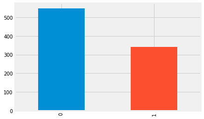


```python
#条形图：查看Cabin的分布
features_df['Cabin'].value_counts().sort_values(ascending=False).head(20).plot(kind='bar')
```


    <matplotlib.axes._subplots.AxesSubplot at 0x276374a0eb8>


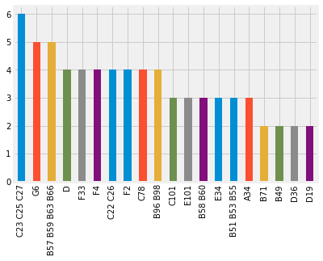


```python
#饼图，查看性别分布
features_df['Sex'].value_counts().sort_values(ascending=False).plot(kind='pie')
```


    <matplotlib.axes._subplots.AxesSubplot at 0x276375922b0>


```python
#直方图，查看年龄分布
features_df['Age'].plot(kind='hist')#注意：有别于条形图，这里会将连续值“分箱”
```


    <matplotlib.axes._subplots.AxesSubplot at 0x27637616eb8>


```python
#箱线图，查看年龄分布
features_df['Age'].plot(kind='box')#可见有绝大部分是20-40岁的年轻人
```


    <matplotlib.axes._subplots.AxesSubplot at 0x27637636a20>


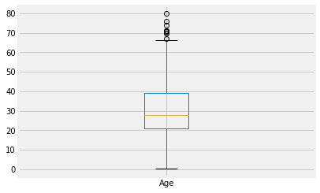


```python
#条形图：查看票价与票类的关系
features_df.groupby('Pclass')['Fare'].mean().plot(kind='bar')#Pclass 1,2,3分别表示头等舱、一等舱、二等舱
```


    <matplotlib.axes._subplots.AxesSubplot at 0x27637616b70>


```python
#将年龄分成1-10的10个阶段，并统计对应票价
def age_bin(x):
    try:
        return int(x/10)
    except:
        None
features_df['Age_bin']=features_df['Age'].apply(age_bin)
features_df.groupby('Age_bin')['Fare'].mean().plot(kind='bar')
```


    <matplotlib.axes._subplots.AxesSubplot at 0x2763776e0b8>


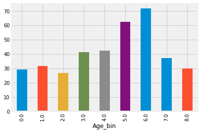


```python
#平滑处理
features_df.groupby('Age_bin')['Fare'].mean().rolling(3).mean().plot(kind='line')#注意:前rolling_num-1项会为None
```


    <matplotlib.axes._subplots.AxesSubplot at 0x27637798630>


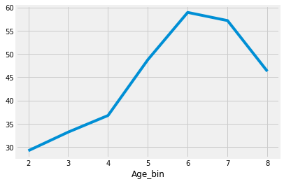


```python
#查看各登船港口与票类的关系
features_df.groupby('Embarked')['Pclass'].mean().plot.bar()
```


    <matplotlib.axes._subplots.AxesSubplot at 0x27637807550>


```python
#探索不同性别，不同年龄段的存活率
show_df=features_df[:891]
show_df['Survived']=labels
show_df=show_df.groupby(['Sex','Age_bin'])['Survived'].mean().reset_index().pivot(index='Sex',columns='Age_bin',values='Survived').reset_index()
show_df=show_df.where(show_df.notnull(),0)
show_df.set_index('Sex',inplace=True,drop=True)
sns.heatmap(show_df)
```


    <matplotlib.axes._subplots.AxesSubplot at 0x2763793cb38>


**注意float.nan无法通过fillna填充**  

可以发现婴儿和女性的存活率更高


```python
#热图：探索不同特征之间的相关系数
show_df=features_df[:891]
show_df['Survived']=labels
sns.heatmap(show_df.corr())
```


    <matplotlib.axes._subplots.AxesSubplot at 0x2763793cac8>


可以发现是否存活与Fare/票价的正相关性最强，与Pclass负相关性最强

### 二.清洗特征
大概知道了各特征的类型以及缺失值情况后，我们就可以对数据进行清洗，将其转换成int/float数据类型

#### 2.1 None值填充
（1）删除...dropna...(不建议)    
（2）暴力填充fillna一个确定的值  
（3）均值、中位数、众数项填充  
（4）依赖性填充  
    4.1）基于时间的插值；  
    4.2）建模预测...


```python
#首先查看缺失项
features_df.isnull().sum()
```


    PassengerId       0
    Pclass            0
    Name              0
    Sex               0
    Age             263
    SibSp             0
    Parch             0
    Ticket            0
    Fare              1
    Cabin          1014
    Embarked          2
    Age_bin         263
    dtype: int64


```python
del features_df['Age_bin']
```


```python
#为Cabin直接填充一个定值
features_df['Cabin'].fillna('missing',inplace=True)
```


```python
#为Embarked填充众数项
features_df['Embarked'].fillna(features_df['Embarked'].mode()[0],inplace=True)
```


```python
#Age与Pclass具有比较强的相关性，利用Age所属Pclass组的均值对其缺失值进行填充
features_df.groupby('Pclass')['Age'].mean().reset_index()
```


<div>
<style scoped>
    .dataframe tbody tr th:only-of-type {
        vertical-align: middle;
    }

    .dataframe tbody tr th {
        vertical-align: top;
    }

    .dataframe thead th {
        text-align: right;
    }
</style>
<table border="1" class="dataframe">
  <thead>
    <tr style="text-align: right;">
      <th></th>
      <th>Pclass</th>
      <th>Age</th>
    </tr>
  </thead>
  <tbody>
    <tr>
      <th>0</th>
      <td>1</td>
      <td>39.159930</td>
    </tr>
    <tr>
      <th>1</th>
      <td>2</td>
      <td>29.506705</td>
    </tr>
    <tr>
      <th>2</th>
      <td>3</td>
      <td>24.816367</td>
    </tr>
  </tbody>
</table>
</div>


```python
def fill_age(pclass,age):
    if np.isnan(age):#注意：如果当前列为float/int类型，当前列中的None会被强制转为float的nan类型
        if pclass==1:
            return 39.159930
        elif pclass==2:
            return 29.506705
        else:
            return 24.816367
    else:
        return age
features_df['Age']=features_df.apply(lambda row:fill_age(row['Pclass'],row['Age']),axis=1)
```


```python
features_df['Fare'].fillna(features_df['Fare'].mean(),inplace=True)
```


```python
#检查一下
features_df.isnull().sum()
```


    PassengerId    0
    Pclass         0
    Name           0
    Sex            0
    Age            0
    SibSp          0
    Parch          0
    Ticket         0
    Fare           0
    Cabin          0
    Embarked       0
    dtype: int64


也可以多种填充策略组合，比如先依赖于相关性高的进行填充，然后利用整体的均值/中位数等填充，然后fillna一个确定的值等，另外sklearn.preprocessing.Imputer也可方便进行均值、中位数、众数填充  

#### 注意：
**
（1）这里没有那一种填充方法是“绝对”的好，要与后续建模中具体使用的模型结合起来，均值类型的填充也许对决策树一类的算法比较友好，fillna(0)也许对lr/神经网络一类的算法比较友好；  
（2）切记在填充的时候不要依赖到y标签，假如Age与Survived的相关性比较强，如果Age依赖于Survived的分组均值进行填充...想想会发生什么....真正在预测的时候我们不知道Survived真实取值，所以压根没法填充...  
（3）另外这里使用整体数据的均值/中位数进行填充涉嫌“作弊”，因为利用到了测试集部分，更正确的做法是利用训练集的信息去对训练集合测试集进行填充，但一般在样本量很大的情况下，两者均值/中位数....相差不大，所以...
**


```python
features_df['Age'].mean()
```


    29.348219164247467


```python
features_df[:891]['Age'].mean()
```


    29.269997269360225


```python
#目前的情况如下
features_df.head(5)
```


<div>
<style scoped>
    .dataframe tbody tr th:only-of-type {
        vertical-align: middle;
    }

    .dataframe tbody tr th {
        vertical-align: top;
    }

    .dataframe thead th {
        text-align: right;
    }
</style>
<table border="1" class="dataframe">
  <thead>
    <tr style="text-align: right;">
      <th></th>
      <th>PassengerId</th>
      <th>Pclass</th>
      <th>Name</th>
      <th>Sex</th>
      <th>Age</th>
      <th>SibSp</th>
      <th>Parch</th>
      <th>Ticket</th>
      <th>Fare</th>
      <th>Cabin</th>
      <th>Embarked</th>
    </tr>
  </thead>
  <tbody>
    <tr>
      <th>0</th>
      <td>1</td>
      <td>3</td>
      <td>Braund, Mr. Owen Harris</td>
      <td>male</td>
      <td>22.0</td>
      <td>1</td>
      <td>0</td>
      <td>A/5 21171</td>
      <td>7.2500</td>
      <td>missing</td>
      <td>S</td>
    </tr>
    <tr>
      <th>1</th>
      <td>2</td>
      <td>1</td>
      <td>Cumings, Mrs. John Bradley (Florence Briggs Th...</td>
      <td>female</td>
      <td>38.0</td>
      <td>1</td>
      <td>0</td>
      <td>PC 17599</td>
      <td>71.2833</td>
      <td>C85</td>
      <td>C</td>
    </tr>
    <tr>
      <th>2</th>
      <td>3</td>
      <td>3</td>
      <td>Heikkinen, Miss. Laina</td>
      <td>female</td>
      <td>26.0</td>
      <td>0</td>
      <td>0</td>
      <td>STON/O2. 3101282</td>
      <td>7.9250</td>
      <td>missing</td>
      <td>S</td>
    </tr>
    <tr>
      <th>3</th>
      <td>4</td>
      <td>1</td>
      <td>Futrelle, Mrs. Jacques Heath (Lily May Peel)</td>
      <td>female</td>
      <td>35.0</td>
      <td>1</td>
      <td>0</td>
      <td>113803</td>
      <td>53.1000</td>
      <td>C123</td>
      <td>S</td>
    </tr>
    <tr>
      <th>4</th>
      <td>5</td>
      <td>3</td>
      <td>Allen, Mr. William Henry</td>
      <td>male</td>
      <td>35.0</td>
      <td>0</td>
      <td>0</td>
      <td>373450</td>
      <td>8.0500</td>
      <td>missing</td>
      <td>S</td>
    </tr>
  </tbody>
</table>
</div>


#### 2.2 类别特征数值化
我们还有5列类别特征，可以将他们分为两类：  
（1）低数量类别特征/low-cardinality categorical attributes：Sex,Embarked  
（2）高数量类别特征/high-cardinality categorical attributes:Name,Ticket,Cabin

我们一个一个看....  

Sex:明显的离散型特征，可以采用ont-hot编码，由于只有两个可取变量，也可以直接编码0/1  
Embarked:明显的离散型特征，可采用one-hot编码  
Name:可以再深入挖掘的一个特征，比如通过名字判断是否结婚  
Ticket:看不出明显的规律，删掉  
Cabin:这里先简单的采用TargetEncoder,一种Smothing的方式，计算y的占比；后面可以扩展特征，比如同一船舱：是否包含中年男性/是否包含小孩....，如果当前乘客为小孩，而他同行的船舱中有中年男性，那存活的可能性更高? 这里，，，先删掉    

这里推荐category_encoders,有多种对离散特征encoding的方式  
pip install category_encoders  
更多：http://contrib.scikit-learn.org/categorical-encoding/  


```python
import category_encoders as ce
del features_df['Name']
del features_df['Ticket']
onehot_encoder = ce.OneHotEncoder(cols=['Embarked']).fit(features_df)
features_df=onehot_encoder.transform(features_df)

ordinay_encoder = ce.OrdinalEncoder(cols=['Sex']).fit(features_df)
features_df=ordinay_encoder.transform(features_df)

#这里我就偷懒了....
target_encoder = ce.TargetEncoder(cols=['Cabin']).fit(features_df[:891],labels)
features_df=target_encoder.transform(features_df)
```


```python
features_df['Sex']=features_df['Sex']-1
```


```python
features_df.head(5)
```


<div>
<style scoped>
    .dataframe tbody tr th:only-of-type {
        vertical-align: middle;
    }

    .dataframe tbody tr th {
        vertical-align: top;
    }

    .dataframe thead th {
        text-align: right;
    }
</style>
<table border="1" class="dataframe">
  <thead>
    <tr style="text-align: right;">
      <th></th>
      <th>PassengerId</th>
      <th>Pclass</th>
      <th>Sex</th>
      <th>Age</th>
      <th>SibSp</th>
      <th>Parch</th>
      <th>Fare</th>
      <th>Cabin</th>
      <th>Embarked_1</th>
      <th>Embarked_2</th>
      <th>Embarked_3</th>
    </tr>
  </thead>
  <tbody>
    <tr>
      <th>0</th>
      <td>1</td>
      <td>3</td>
      <td>0</td>
      <td>22.0</td>
      <td>1</td>
      <td>0</td>
      <td>7.2500</td>
      <td>0.299854</td>
      <td>1</td>
      <td>0</td>
      <td>0</td>
    </tr>
    <tr>
      <th>1</th>
      <td>2</td>
      <td>1</td>
      <td>1</td>
      <td>38.0</td>
      <td>1</td>
      <td>0</td>
      <td>71.2833</td>
      <td>0.383838</td>
      <td>0</td>
      <td>1</td>
      <td>0</td>
    </tr>
    <tr>
      <th>2</th>
      <td>3</td>
      <td>3</td>
      <td>1</td>
      <td>26.0</td>
      <td>0</td>
      <td>0</td>
      <td>7.9250</td>
      <td>0.299854</td>
      <td>1</td>
      <td>0</td>
      <td>0</td>
    </tr>
    <tr>
      <th>3</th>
      <td>4</td>
      <td>1</td>
      <td>1</td>
      <td>35.0</td>
      <td>1</td>
      <td>0</td>
      <td>53.1000</td>
      <td>0.468759</td>
      <td>1</td>
      <td>0</td>
      <td>0</td>
    </tr>
    <tr>
      <th>4</th>
      <td>5</td>
      <td>3</td>
      <td>0</td>
      <td>35.0</td>
      <td>0</td>
      <td>0</td>
      <td>8.0500</td>
      <td>0.299854</td>
      <td>1</td>
      <td>0</td>
      <td>0</td>
    </tr>
  </tbody>
</table>
</div>


```python
#这里PassengerId直接删掉
del features_df['PassengerId']
```

#### 2.3数据标准化
数据是否需要标准化取决于后面的训练模型，一般来说，数据归一化有如下的一些好处：  
（1）保持量纲的统一；  
（2）梯度下降更稳定；

它对常见算法的影响：  
（1）knn,kmeans：欧氏距离...  
（2）lr,svm,nn：梯度下降...  
（3）pca：偏向于值较大的列  

标准化的方法一般有以下几种：  
（1）z-score：$z=(x-u)/\sigma$  
（2）min-max：$m=(x-x_{min})/(x_{max}-x_{min})$  
（3）行归一化：$\sqrt{(x_1^2+x_2^2+\cdots+x_n^2)}=1,这里x_1,x_2,...,x_n表示每行特征$；  
其他的标准化方法：  
（1）log/boxcox归一化：对长尾分布数据比较有用，可以拉伸头部，压缩尾部

更多：https://www.jianshu.com/p/fa73a07cd750


```python
from sklearn.preprocessing import StandardScaler,MinMaxScaler,Normalizer
#z-score归一化
titanic_z_score_df=pd.DataFrame(StandardScaler().fit_transform(features_df),columns=features_df.columns)
#min-max归一化
titanic_min_max_df=pd.DataFrame(MinMaxScaler().fit_transform(features_df),columns=features_df.columns)
#行归一化
titanic_normalize_df=pd.DataFrame(Normalizer().fit_transform(features_df),columns=features_df.columns)
```


```python
titanic_z_score_df.head(5)
```


<div>
<style scoped>
    .dataframe tbody tr th:only-of-type {
        vertical-align: middle;
    }

    .dataframe tbody tr th {
        vertical-align: top;
    }

    .dataframe thead th {
        text-align: right;
    }
</style>
<table border="1" class="dataframe">
  <thead>
    <tr style="text-align: right;">
      <th></th>
      <th>Pclass</th>
      <th>Sex</th>
      <th>Age</th>
      <th>SibSp</th>
      <th>Parch</th>
      <th>Fare</th>
      <th>Cabin</th>
      <th>Embarked_1</th>
      <th>Embarked_2</th>
      <th>Embarked_3</th>
    </tr>
  </thead>
  <tbody>
    <tr>
      <th>0</th>
      <td>0.841916</td>
      <td>-0.743497</td>
      <td>-0.559957</td>
      <td>0.481288</td>
      <td>-0.445</td>
      <td>-0.503595</td>
      <td>-0.355244</td>
      <td>0.655011</td>
      <td>-0.50977</td>
      <td>-0.32204</td>
    </tr>
    <tr>
      <th>1</th>
      <td>-1.546098</td>
      <td>1.344995</td>
      <td>0.659292</td>
      <td>0.481288</td>
      <td>-0.445</td>
      <td>0.734503</td>
      <td>0.314031</td>
      <td>-1.526692</td>
      <td>1.96167</td>
      <td>-0.32204</td>
    </tr>
    <tr>
      <th>2</th>
      <td>0.841916</td>
      <td>1.344995</td>
      <td>-0.255145</td>
      <td>-0.479087</td>
      <td>-0.445</td>
      <td>-0.490544</td>
      <td>-0.355244</td>
      <td>0.655011</td>
      <td>-0.50977</td>
      <td>-0.32204</td>
    </tr>
    <tr>
      <th>3</th>
      <td>-1.546098</td>
      <td>1.344995</td>
      <td>0.430683</td>
      <td>0.481288</td>
      <td>-0.445</td>
      <td>0.382925</td>
      <td>0.990773</td>
      <td>0.655011</td>
      <td>-0.50977</td>
      <td>-0.32204</td>
    </tr>
    <tr>
      <th>4</th>
      <td>0.841916</td>
      <td>-0.743497</td>
      <td>0.430683</td>
      <td>-0.479087</td>
      <td>-0.445</td>
      <td>-0.488127</td>
      <td>-0.355244</td>
      <td>0.655011</td>
      <td>-0.50977</td>
      <td>-0.32204</td>
    </tr>
  </tbody>
</table>
</div>


```python
titanic_min_max_df.head(5)
```


<div>
<style scoped>
    .dataframe tbody tr th:only-of-type {
        vertical-align: middle;
    }

    .dataframe tbody tr th {
        vertical-align: top;
    }

    .dataframe thead th {
        text-align: right;
    }
</style>
<table border="1" class="dataframe">
  <thead>
    <tr style="text-align: right;">
      <th></th>
      <th>Pclass</th>
      <th>Sex</th>
      <th>Age</th>
      <th>SibSp</th>
      <th>Parch</th>
      <th>Fare</th>
      <th>Cabin</th>
      <th>Embarked_1</th>
      <th>Embarked_2</th>
      <th>Embarked_3</th>
    </tr>
  </thead>
  <tbody>
    <tr>
      <th>0</th>
      <td>1.0</td>
      <td>0.0</td>
      <td>0.273456</td>
      <td>0.125</td>
      <td>0.0</td>
      <td>0.014151</td>
      <td>0.226644</td>
      <td>1.0</td>
      <td>0.0</td>
      <td>0.0</td>
    </tr>
    <tr>
      <th>1</th>
      <td>0.0</td>
      <td>1.0</td>
      <td>0.473882</td>
      <td>0.125</td>
      <td>0.0</td>
      <td>0.139136</td>
      <td>0.323450</td>
      <td>0.0</td>
      <td>1.0</td>
      <td>0.0</td>
    </tr>
    <tr>
      <th>2</th>
      <td>1.0</td>
      <td>1.0</td>
      <td>0.323563</td>
      <td>0.000</td>
      <td>0.0</td>
      <td>0.015469</td>
      <td>0.226644</td>
      <td>1.0</td>
      <td>0.0</td>
      <td>0.0</td>
    </tr>
    <tr>
      <th>3</th>
      <td>0.0</td>
      <td>1.0</td>
      <td>0.436302</td>
      <td>0.125</td>
      <td>0.0</td>
      <td>0.103644</td>
      <td>0.421336</td>
      <td>1.0</td>
      <td>0.0</td>
      <td>0.0</td>
    </tr>
    <tr>
      <th>4</th>
      <td>1.0</td>
      <td>0.0</td>
      <td>0.436302</td>
      <td>0.000</td>
      <td>0.0</td>
      <td>0.015713</td>
      <td>0.226644</td>
      <td>1.0</td>
      <td>0.0</td>
      <td>0.0</td>
    </tr>
  </tbody>
</table>
</div>


```python
titanic_normalize_df.head(5)
```


<div>
<style scoped>
    .dataframe tbody tr th:only-of-type {
        vertical-align: middle;
    }

    .dataframe tbody tr th {
        vertical-align: top;
    }

    .dataframe thead th {
        text-align: right;
    }
</style>
<table border="1" class="dataframe">
  <thead>
    <tr style="text-align: right;">
      <th></th>
      <th>Pclass</th>
      <th>Sex</th>
      <th>Age</th>
      <th>SibSp</th>
      <th>Parch</th>
      <th>Fare</th>
      <th>Cabin</th>
      <th>Embarked_1</th>
      <th>Embarked_2</th>
      <th>Embarked_3</th>
    </tr>
  </thead>
  <tbody>
    <tr>
      <th>0</th>
      <td>0.128194</td>
      <td>0.000000</td>
      <td>0.940092</td>
      <td>0.042731</td>
      <td>0.0</td>
      <td>0.309803</td>
      <td>0.012813</td>
      <td>0.042731</td>
      <td>0.000000</td>
      <td>0.0</td>
    </tr>
    <tr>
      <th>1</th>
      <td>0.012375</td>
      <td>0.012375</td>
      <td>0.470268</td>
      <td>0.012375</td>
      <td>0.0</td>
      <td>0.882164</td>
      <td>0.004750</td>
      <td>0.000000</td>
      <td>0.012375</td>
      <td>0.0</td>
    </tr>
    <tr>
      <th>2</th>
      <td>0.109552</td>
      <td>0.036517</td>
      <td>0.949452</td>
      <td>0.000000</td>
      <td>0.0</td>
      <td>0.289400</td>
      <td>0.010950</td>
      <td>0.036517</td>
      <td>0.000000</td>
      <td>0.0</td>
    </tr>
    <tr>
      <th>3</th>
      <td>0.015716</td>
      <td>0.015716</td>
      <td>0.550051</td>
      <td>0.015716</td>
      <td>0.0</td>
      <td>0.834507</td>
      <td>0.007367</td>
      <td>0.015716</td>
      <td>0.000000</td>
      <td>0.0</td>
    </tr>
    <tr>
      <th>4</th>
      <td>0.083208</td>
      <td>0.000000</td>
      <td>0.970766</td>
      <td>0.000000</td>
      <td>0.0</td>
      <td>0.223276</td>
      <td>0.008317</td>
      <td>0.027736</td>
      <td>0.000000</td>
      <td>0.0</td>
    </tr>
  </tbody>
</table>
</div>


```python
#注意：z-score,min-max这两种变换都是线性变换，不会改变分布形状
titanic_min_max_df['Age'].plot(kind='hist')
```


    <matplotlib.axes._subplots.AxesSubplot at 0x27638b947b8>


```python
titanic_z_score_df['Age'].plot(kind='hist')
```


    <matplotlib.axes._subplots.AxesSubplot at 0x27638be95c0>


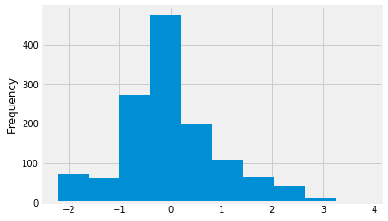


```python
#行归一化会改变
titanic_normalize_df['Age'].plot(kind='hist')
```


    <matplotlib.axes._subplots.AxesSubplot at 0x27638c0b198>


```python
#pdf:标准正态分布的概率密度函数
from scipy.stats import norm
age_mean=features_df['Age'].mean()
age_std=features_df['Age'].std()
features_df['Age'].apply(lambda x:norm.pdf((x-age_mean)/age_std)).plot(kind='hist')
```


    <matplotlib.axes._subplots.AxesSubplot at 0x27638cdc6d8>


```python
#cdf:分布函数
features_df['Age'].apply(lambda x:norm.cdf((x-age_mean)/age_std)).plot(kind='hist')
```


    <matplotlib.axes._subplots.AxesSubplot at 0x27638cf2080>


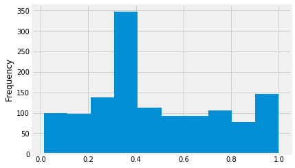


```python
#log
features_df['Age'].apply(lambda x:np.log1p(x)).plot(kind='hist')
```


    <matplotlib.axes._subplots.AxesSubplot at 0x27637972518>


```python
#boxcox
from scipy.stats import boxcox
plt.hist(boxcox(features_df['Age'])[0])
```


    (array([ 51.,  35.,  48., 274., 478., 210., 118.,  55.,  32.,   8.]),
     array([-0.97171828,  2.70253966,  6.37679759, 10.05105553, 13.72531346,
            17.39957139, 21.07382933, 24.74808726, 28.42234519, 32.09660313,
            35.77086106]),
     <a list of 10 Patch objects>)


```python
#最佳lambda
boxcox(features_df['Age'])[1]
```


    0.7627222156380012


### 三.选择基准模型
（1）**目标**：本数据集是预测乘客是否存活，所以可以看做是分类任务；  
（2）**量化目标**：选择合适的评估指标，这里我们可以选择f1；  
（3）从分类模型中选择一个较优的模型作为基准模型，这是一个比较繁琐的工作；  


```python
data_x=StandardScaler().fit_transform(features_df[:891])
#切分训练集测试集
X_train,X_test, y_train, y_test =train_test_split(data_x,labels,test_size=0.2, random_state=42)
#训练模型
classifier=LogisticRegression()
classifier.fit(X_train,y_train)
#预测数据
y_predict=classifier.predict(X_test)
#查看检测指标
f1_score=metrics.f1_score(y_test,y_predict)
f1_score
```


    0.7862068965517242


```python
#为了结果更加客观，可以做k-fold交叉验证，但会更耗时

classifier=LogisticRegression()
scores = cross_val_score(classifier, data_x, labels, scoring='f1', cv = 5)#注意：f1只是看正样本的f1,如果要看整体的用f1_macro,但这一般会使得f1偏高
#查看均值与标准差,均值反映模型的预测能力，标准差可以反映模型的稳定性
np.mean(scores),np.std(scores)
```


    (0.759262777574798, 0.016196297194678546)


```python
#我们再看看另一种分类器
classifier=GradientBoostingClassifier()
scores = cross_val_score(classifier, features_df[:891], labels, scoring='f1', cv = 5)
np.mean(scores),np.std(scores)
```


    (0.7724798337990278, 0.052794300926641495)


#### 定位模型能力：方差与偏差
可以参考下面图为我们的模型做定位：  

来源:https://blog.csdn.net/hertzcat/article/details/80035330

#### 检查过/欠拟合情况
过/欠拟合可以通过模型在训练集/验证集/测试集上的表现来评估，  
（1）训练集/验证集/测试集效果都比较差，可以看作是欠拟合(除非训练数据真的是太差了)，这时可以增加模型的复杂度试一试；  
（2）训练集的表现好，而验证集/测试集的表现差，一般就是过拟合（这也是经常会遇到的问题），可以下面的一些方式常识：  
    2.1）降低模型复杂度：1.换更简单的模型，2.正则化技术  
    2.2）增强训练数据  


```python
#查看lr的训练集，测试集的情况
classifier=LogisticRegression()
classifier.fit(X_train,y_train)
y_test_predict=classifier.predict(X_test)
test_f1_score=metrics.f1_score(y_test,y_test_predict)

y_train_predict=classifier.predict(X_train)
train_f1_score=metrics.f1_score(y_train,y_train_predict)
print('train:',train_f1_score,'\t test:',test_f1_score)
```

    train: 0.7630057803468208 	 test: 0.7862068965517242
    


```python
#查看gbdt的训练集，测试集的情况
classifier=GradientBoostingClassifier()
classifier.fit(X_train,y_train)
y_test_predict=classifier.predict(X_test)
test_f1_score=metrics.f1_score(y_test,y_test_predict)

y_train_predict=classifier.predict(X_train)
train_f1_score=metrics.f1_score(y_train,y_train_predict)
print('train:',train_f1_score,'\t test:',test_f1_score)
```

    train: 0.8641975308641976 	 test: 0.7826086956521738
    

可以发现gbdt有点过拟合了，lr很稳定，然后我们可以看出模型过拟合/欠拟合与模型方差/偏差的一些关系：  
（1）欠拟合模型往往偏差大（这里对应f1指标较小）  
（2）过拟合模型往往方差较大（这里对应f1的标准差较大）  
接下来可以通过降低gbdt中cart树数量的方式来降低模型复杂度：  


```python
classifier=GradientBoostingClassifier(n_estimators=80)#默认是100
scores = cross_val_score(classifier, data_x, labels, scoring='f1', cv = 5)
np.mean(scores),np.std(scores)
```


    (0.7770062297307175, 0.04740066888740136)


```python
classifier=GradientBoostingClassifier(n_estimators=80)
classifier.fit(X_train,y_train)
y_test_predict=classifier.predict(X_test)
test_f1_score=metrics.f1_score(y_test,y_test_predict)

y_train_predict=classifier.predict(X_train)
train_f1_score=metrics.f1_score(y_train,y_train_predict)
print('train:',train_f1_score,'\t test:',test_f1_score)
```

    train: 0.8588957055214724 	 test: 0.7769784172661871
    

### 四.优化
对于建模的优化，可以自然的从三方面来考虑：  
（1）特征优化：扩展特征，特征选择，特征转换...  
（2）数据增强：过采样、根据数据特性造新数据、半监督学习...  
（3）模型优化：超参优化、模型集成...

#### 4.1.1 特征扩展：推理
凭借自己对数据的理解构建有意义的特征，比如：  
通过Cabin关联乘客的同行者的信息，根据前面的性别-存活率的热图，我们扩展这样的特征：是否有其他小孩(Age<=10), 是否有其他女性，是否有其他老人(age>=70),是否有其他青年男性（20<=Age<=50），以及当前cabin的人数


```python
extend_df=origin_features_df[['PassengerId','Age','Sex','Name','Cabin']]
extend_df=extend_df[~extend_df['Cabin'].isnull()]
```


```python
extend_df2=extend_df[['Age','Name','Sex','Cabin']]
extend_df2.columns=['Age2','Name2','Sex2','Cabin']
```


```python
merge_df=pd.merge(extend_df,extend_df2,on='Cabin',how='left')
```


```python
def check_has_other_child(name1,name2,age2):
    if name1==name2:
        return 0
    else:
        if age2<=10:
            return 1
        else:
            return 0
merge_df['Has_other_child']=merge_df.apply(lambda row:check_has_other_child(row['Name'],row['Name2'],row['Age2']),axis=1)
```


```python
def check_has_other_female(name1,name2,sex2):
    if name1==name2:
        return 0
    else:
        if sex2=='female':
            return 1
        else:
            return 0
merge_df['Has_other_female']=merge_df.apply(lambda row:check_has_other_female(row['Name'],row['Name2'],row['Sex2']),axis=1)
```


```python
def check_has_other_old(name1,name2,age2):
    if name1==name2:
        return 0
    else:
        if age2>=70:
            return 1
        else:
            return 0
merge_df['Has_other_old']=merge_df.apply(lambda row:check_has_other_old(row['Name'],row['Name2'],row['Age2']),axis=1)
```


```python
def check_has_young_male(name1,name2,sex2,age2):
    if name1==name2:
        return 0
    else:
        if sex2=='male' and age2>=20 and age2<=50:
            return 1
        else:
            return 0
merge_df['Has_other_young_male']=merge_df.apply(lambda row:check_has_young_male(row['Name'],row['Name2'],row['Sex2'],row['Age2']),axis=1)
```


```python
merge_df=merge_df[['PassengerId','Has_other_child','Has_other_female','Has_other_old','Has_other_young_male']]
```


```python
#去重
gp_df=merge_df.groupby(by=['PassengerId']).agg({'Has_other_child':'max','Has_other_female':'max','Has_other_old':'max','Has_other_young_male':'max'}).reset_index()
```


```python
gp_df.head(5)
```


<div>
<style scoped>
    .dataframe tbody tr th:only-of-type {
        vertical-align: middle;
    }

    .dataframe tbody tr th {
        vertical-align: top;
    }

    .dataframe thead th {
        text-align: right;
    }
</style>
<table border="1" class="dataframe">
  <thead>
    <tr style="text-align: right;">
      <th></th>
      <th>PassengerId</th>
      <th>Has_other_child</th>
      <th>Has_other_female</th>
      <th>Has_other_old</th>
      <th>Has_other_young_male</th>
    </tr>
  </thead>
  <tbody>
    <tr>
      <th>0</th>
      <td>2</td>
      <td>0</td>
      <td>0</td>
      <td>0</td>
      <td>1</td>
    </tr>
    <tr>
      <th>1</th>
      <td>4</td>
      <td>0</td>
      <td>0</td>
      <td>0</td>
      <td>1</td>
    </tr>
    <tr>
      <th>2</th>
      <td>7</td>
      <td>0</td>
      <td>0</td>
      <td>0</td>
      <td>0</td>
    </tr>
    <tr>
      <th>3</th>
      <td>11</td>
      <td>1</td>
      <td>1</td>
      <td>0</td>
      <td>0</td>
    </tr>
    <tr>
      <th>4</th>
      <td>12</td>
      <td>0</td>
      <td>0</td>
      <td>0</td>
      <td>0</td>
    </tr>
  </tbody>
</table>
</div>


```python
extend_df=pd.merge(origin_features_df[['PassengerId']],gp_df,on='PassengerId',how='left')
extend_df.fillna(0,inplace=True)
```


```python
extend_df.head(5)
```


<div>
<style scoped>
    .dataframe tbody tr th:only-of-type {
        vertical-align: middle;
    }

    .dataframe tbody tr th {
        vertical-align: top;
    }

    .dataframe thead th {
        text-align: right;
    }
</style>
<table border="1" class="dataframe">
  <thead>
    <tr style="text-align: right;">
      <th></th>
      <th>PassengerId</th>
      <th>Has_other_child</th>
      <th>Has_other_female</th>
      <th>Has_other_old</th>
      <th>Has_other_young_male</th>
    </tr>
  </thead>
  <tbody>
    <tr>
      <th>0</th>
      <td>1</td>
      <td>0.0</td>
      <td>0.0</td>
      <td>0.0</td>
      <td>0.0</td>
    </tr>
    <tr>
      <th>1</th>
      <td>2</td>
      <td>0.0</td>
      <td>0.0</td>
      <td>0.0</td>
      <td>1.0</td>
    </tr>
    <tr>
      <th>2</th>
      <td>3</td>
      <td>0.0</td>
      <td>0.0</td>
      <td>0.0</td>
      <td>0.0</td>
    </tr>
    <tr>
      <th>3</th>
      <td>4</td>
      <td>0.0</td>
      <td>0.0</td>
      <td>0.0</td>
      <td>1.0</td>
    </tr>
    <tr>
      <th>4</th>
      <td>5</td>
      <td>0.0</td>
      <td>0.0</td>
      <td>0.0</td>
      <td>0.0</td>
    </tr>
  </tbody>
</table>
</div>


```python
del extend_df['PassengerId']
features_df=pd.concat([features_df,extend_df],axis=1)
```


```python
features_df.head(5)
```


<div>
<style scoped>
    .dataframe tbody tr th:only-of-type {
        vertical-align: middle;
    }

    .dataframe tbody tr th {
        vertical-align: top;
    }

    .dataframe thead th {
        text-align: right;
    }
</style>
<table border="1" class="dataframe">
  <thead>
    <tr style="text-align: right;">
      <th></th>
      <th>Pclass</th>
      <th>Sex</th>
      <th>Age</th>
      <th>SibSp</th>
      <th>Parch</th>
      <th>Fare</th>
      <th>Cabin</th>
      <th>Embarked_1</th>
      <th>Embarked_2</th>
      <th>Embarked_3</th>
      <th>Has_other_child</th>
      <th>Has_other_female</th>
      <th>Has_other_old</th>
      <th>Has_other_young_male</th>
    </tr>
  </thead>
  <tbody>
    <tr>
      <th>0</th>
      <td>3</td>
      <td>0</td>
      <td>22.0</td>
      <td>1</td>
      <td>0</td>
      <td>7.2500</td>
      <td>0.299854</td>
      <td>1</td>
      <td>0</td>
      <td>0</td>
      <td>0.0</td>
      <td>0.0</td>
      <td>0.0</td>
      <td>0.0</td>
    </tr>
    <tr>
      <th>1</th>
      <td>1</td>
      <td>1</td>
      <td>38.0</td>
      <td>1</td>
      <td>0</td>
      <td>71.2833</td>
      <td>0.383838</td>
      <td>0</td>
      <td>1</td>
      <td>0</td>
      <td>0.0</td>
      <td>0.0</td>
      <td>0.0</td>
      <td>1.0</td>
    </tr>
    <tr>
      <th>2</th>
      <td>3</td>
      <td>1</td>
      <td>26.0</td>
      <td>0</td>
      <td>0</td>
      <td>7.9250</td>
      <td>0.299854</td>
      <td>1</td>
      <td>0</td>
      <td>0</td>
      <td>0.0</td>
      <td>0.0</td>
      <td>0.0</td>
      <td>0.0</td>
    </tr>
    <tr>
      <th>3</th>
      <td>1</td>
      <td>1</td>
      <td>35.0</td>
      <td>1</td>
      <td>0</td>
      <td>53.1000</td>
      <td>0.468759</td>
      <td>1</td>
      <td>0</td>
      <td>0</td>
      <td>0.0</td>
      <td>0.0</td>
      <td>0.0</td>
      <td>1.0</td>
    </tr>
    <tr>
      <th>4</th>
      <td>3</td>
      <td>0</td>
      <td>35.0</td>
      <td>0</td>
      <td>0</td>
      <td>8.0500</td>
      <td>0.299854</td>
      <td>1</td>
      <td>0</td>
      <td>0</td>
      <td>0.0</td>
      <td>0.0</td>
      <td>0.0</td>
      <td>0.0</td>
    </tr>
  </tbody>
</table>
</div>


```python
#检查效果
classifier=GradientBoostingClassifier()
scores = cross_val_score(classifier, features_df[:891], labels, scoring='f1', cv = 5)
np.mean(scores),np.std(scores)
```


    (0.7769165138086762, 0.045459742819809204)


#### 4.1.1 特征扩展：推理
之前我们删掉了Name，其实Name中的姓可以反应一些特征，比如Mrs可以放映出该乘客已经结婚，Miss表示未婚小姐姐，我们将其提取出来，另外SibSp表示乘客兄弟姐妹/配偶的个数，而Parch表示乘客父母/孩子的个数，可以简单相加表示他们的家庭成员多少，越多的存活率可能越高...  

更多:https://www.kaggle.com/gunesevitan/advanced-feature-engineering-tutorial-with-titanic


```python
features_df['family_size']=features_df['SibSp']+features_df['Parch']+1
```


```python
#统计存活率分布
show_df=features_df[:891]
show_df['Survived']=labels
show_df.groupby('family_size')['Survived'].mean().plot(kind='bar')
```


    <matplotlib.axes._subplots.AxesSubplot at 0x276375fc748>


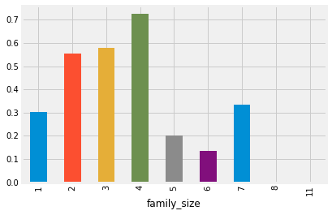


```python
show_df.groupby('family_size')['Survived'].count().plot(kind='bar')
```


    <matplotlib.axes._subplots.AxesSubplot at 0x27638f94550>


```python
#提取姓名中的title
origin_features_df['Name'].apply(lambda name:name.split(',')[1].split('.')[0]).value_counts()
```


     Mr              757
     Miss            260
     Mrs             197
     Master           61
     Dr                8
     Rev               8
     Col               4
     Major             2
     Ms                2
     Mlle              2
     Lady              1
     Jonkheer          1
     Dona              1
     Capt              1
     Don               1
     Sir               1
     Mme               1
     the Countess      1
    Name: Name, dtype: int64


```python
titles=['Mr','Miss','Mrs','Master']
def extract_title(name):
    for title in titles:
        if title in name:
            return title
    return 'Other'
features_df['name_title']=origin_features_df['Name'].apply(extract_title)
```


```python
features_df=pd.get_dummies(features_df,columns=['name_title'])
```


```python
features_df.head()
```


<div>
<style scoped>
    .dataframe tbody tr th:only-of-type {
        vertical-align: middle;
    }

    .dataframe tbody tr th {
        vertical-align: top;
    }

    .dataframe thead th {
        text-align: right;
    }
</style>
<table border="1" class="dataframe">
  <thead>
    <tr style="text-align: right;">
      <th></th>
      <th>Pclass</th>
      <th>Sex</th>
      <th>Age</th>
      <th>SibSp</th>
      <th>Parch</th>
      <th>Fare</th>
      <th>Cabin</th>
      <th>Embarked_1</th>
      <th>Embarked_2</th>
      <th>Embarked_3</th>
      <th>Has_other_child</th>
      <th>Has_other_female</th>
      <th>Has_other_old</th>
      <th>Has_other_young_male</th>
      <th>family_size</th>
      <th>name_title_Master</th>
      <th>name_title_Miss</th>
      <th>name_title_Mr</th>
      <th>name_title_Other</th>
    </tr>
  </thead>
  <tbody>
    <tr>
      <th>0</th>
      <td>3</td>
      <td>0</td>
      <td>22.0</td>
      <td>1</td>
      <td>0</td>
      <td>7.2500</td>
      <td>0.299854</td>
      <td>1</td>
      <td>0</td>
      <td>0</td>
      <td>0.0</td>
      <td>0.0</td>
      <td>0.0</td>
      <td>0.0</td>
      <td>2</td>
      <td>0</td>
      <td>0</td>
      <td>1</td>
      <td>0</td>
    </tr>
    <tr>
      <th>1</th>
      <td>1</td>
      <td>1</td>
      <td>38.0</td>
      <td>1</td>
      <td>0</td>
      <td>71.2833</td>
      <td>0.383838</td>
      <td>0</td>
      <td>1</td>
      <td>0</td>
      <td>0.0</td>
      <td>0.0</td>
      <td>0.0</td>
      <td>1.0</td>
      <td>2</td>
      <td>0</td>
      <td>0</td>
      <td>1</td>
      <td>0</td>
    </tr>
    <tr>
      <th>2</th>
      <td>3</td>
      <td>1</td>
      <td>26.0</td>
      <td>0</td>
      <td>0</td>
      <td>7.9250</td>
      <td>0.299854</td>
      <td>1</td>
      <td>0</td>
      <td>0</td>
      <td>0.0</td>
      <td>0.0</td>
      <td>0.0</td>
      <td>0.0</td>
      <td>1</td>
      <td>0</td>
      <td>1</td>
      <td>0</td>
      <td>0</td>
    </tr>
    <tr>
      <th>3</th>
      <td>1</td>
      <td>1</td>
      <td>35.0</td>
      <td>1</td>
      <td>0</td>
      <td>53.1000</td>
      <td>0.468759</td>
      <td>1</td>
      <td>0</td>
      <td>0</td>
      <td>0.0</td>
      <td>0.0</td>
      <td>0.0</td>
      <td>1.0</td>
      <td>2</td>
      <td>0</td>
      <td>0</td>
      <td>1</td>
      <td>0</td>
    </tr>
    <tr>
      <th>4</th>
      <td>3</td>
      <td>0</td>
      <td>35.0</td>
      <td>0</td>
      <td>0</td>
      <td>8.0500</td>
      <td>0.299854</td>
      <td>1</td>
      <td>0</td>
      <td>0</td>
      <td>0.0</td>
      <td>0.0</td>
      <td>0.0</td>
      <td>0.0</td>
      <td>1</td>
      <td>0</td>
      <td>0</td>
      <td>1</td>
      <td>0</td>
    </tr>
  </tbody>
</table>
</div>


```python
#检查效果
classifier=GradientBoostingClassifier()
scores = cross_val_score(classifier, features_df[:891], labels, scoring='f1', cv = 5)
np.mean(scores),np.std(scores)
```


    (0.7863861150429007, 0.045106415307000484)


#### 4.1.1 扩展特征：添加聚类标签
聚类标签可以看作是对目前样本的做的特征映射，将高维空间相似的特征映射到相同的标签；  
这里演示用kmean生成聚类标签，利用calinski_harabaz选择较优的k，  
更多：https://blog.csdn.net/u010159842/article/details/78624135


```python
cluster_data_np=StandardScaler().fit_transform(features_df)
```


```python
K=range(2,20)
calinski_harabaz_scores=[]
for k in K:
    kmeans=KMeans(n_clusters=k)
    kmeans.fit(cluster_data_np)
    calinski_harabaz_scores.append(metrics.calinski_harabaz_score(cluster_data_np, kmeans.predict(cluster_data_np)))
plt.plot(K,calinski_harabaz_scores,'bx-')
plt.xlabel('k')
plt.ylabel(u'distortion degree')
```


    Text(0,0.5,'distortion degree')


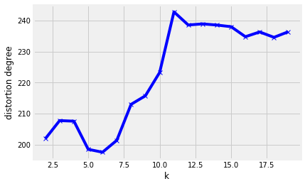


```python
kmeans=KMeans(n_clusters=11)
kmeans.fit(cluster_data_np)
ext_cluster_fea_df=copy.deepcopy(features_df)
ext_cluster_fea_df['cluster_factor']=kmeans.predict(cluster_data_np)
```


```python
ext_cluster_fea_dummy_df = pd.get_dummies(ext_cluster_fea_df,columns=['cluster_factor'])
```


```python
#检查效果
classifier=GradientBoostingClassifier()
scores = cross_val_score(classifier, ext_cluster_fea_dummy_df[:891], labels, scoring='f1', cv = 5)
np.mean(scores),np.std(scores)
```


    (0.7909764830595335, 0.046701857326420175)


不过貌似这样选择的k做的聚类因子未必是最好的....可以多尝试几种...

#### 4.1.1  扩展特征：数值特征
对数值特征的扩展，可以考虑：  
（1）连续值分箱：某些特征分箱可能可以体现不一样的意义...  
（2）log变换等...改变原始数据的分布特性...  
（3）无脑构造多项式/交互特征：$[a,b]->[1,a,b,a^2,b^2,ab]$  
接下来试一试...


```python
ext_fea_df=copy.deepcopy(ext_cluster_fea_dummy_df)
ext_fea_df['Age_bins']=pd.cut(ext_fea_df['Age'],bins=10,labels=False)#对age分箱
ext_fea_df['Fare_bins']=pd.cut(ext_fea_df['Fare'],bins=10,labels=False)#对Fare分箱
ext_fea_df['Age_log']=ext_fea_df['Age'].apply(lambda x:np.log1p(x))#log变换
ext_fea_df['Age_log_cdf']=ext_fea_df['Age_log'].apply(lambda x:norm.cdf((x-ext_fea_df['Age_log'].mean())/ext_fea_df['Age_log'].std()))#cdf变换
```


```python
#lr
ext_fea_np=StandardScaler().fit_transform(ext_fea_df[:891])
classifier=LogisticRegression()
scores = cross_val_score(classifier, ext_fea_np, labels, scoring='f1', cv = 5)
np.mean(scores),np.std(scores)
```


    (0.781605275854118, 0.028909134651025126)


```python
#gbdt
classifier=GradientBoostingClassifier()
scores = cross_val_score(classifier, ext_fea_np, labels, scoring='f1', cv = 5)
np.mean(scores),np.std(scores)
```


    (0.7864075819002644, 0.04520773057627748)


```python
#构造交互特征：一般来说选择0/1类型的特征来构造更make sense
poly=PolynomialFeatures(degree=2,include_bias=False,interaction_only=False)#无脑多项式转换
poly_fea_np=poly.fit_transform(ext_fea_df)#这里是numpy类型
poly_fea_df=pd.DataFrame(poly_fea_np,columns=poly.get_feature_names())
```

**注意：构造多项式特征慎用，它以$O(n^2)$增涨特征量，如果原始有1000个特征，变换后会有100W个特征...**


```python
poly_fea_df.head(5)
```


<div>
<style scoped>
    .dataframe tbody tr th:only-of-type {
        vertical-align: middle;
    }

    .dataframe tbody tr th {
        vertical-align: top;
    }

    .dataframe thead th {
        text-align: right;
    }
</style>
<table border="1" class="dataframe">
  <thead>
    <tr style="text-align: right;">
      <th></th>
      <th>x0</th>
      <th>x1</th>
      <th>x2</th>
      <th>x3</th>
      <th>x4</th>
      <th>x5</th>
      <th>x6</th>
      <th>x7</th>
      <th>x8</th>
      <th>x9</th>
      <th>...</th>
      <th>x30^2</th>
      <th>x30 x31</th>
      <th>x30 x32</th>
      <th>x30 x33</th>
      <th>x31^2</th>
      <th>x31 x32</th>
      <th>x31 x33</th>
      <th>x32^2</th>
      <th>x32 x33</th>
      <th>x33^2</th>
    </tr>
  </thead>
  <tbody>
    <tr>
      <th>0</th>
      <td>3.0</td>
      <td>0.0</td>
      <td>22.0</td>
      <td>1.0</td>
      <td>0.0</td>
      <td>7.2500</td>
      <td>0.299854</td>
      <td>1.0</td>
      <td>0.0</td>
      <td>0.0</td>
      <td>...</td>
      <td>4.0</td>
      <td>0.0</td>
      <td>6.270988</td>
      <td>0.808603</td>
      <td>0.0</td>
      <td>0.000000</td>
      <td>0.000000</td>
      <td>9.831324</td>
      <td>1.267685</td>
      <td>0.163460</td>
    </tr>
    <tr>
      <th>1</th>
      <td>1.0</td>
      <td>1.0</td>
      <td>38.0</td>
      <td>1.0</td>
      <td>0.0</td>
      <td>71.2833</td>
      <td>0.383838</td>
      <td>0.0</td>
      <td>1.0</td>
      <td>0.0</td>
      <td>...</td>
      <td>16.0</td>
      <td>4.0</td>
      <td>14.654247</td>
      <td>2.942756</td>
      <td>1.0</td>
      <td>3.663562</td>
      <td>0.735689</td>
      <td>13.421684</td>
      <td>2.695242</td>
      <td>0.541238</td>
    </tr>
    <tr>
      <th>2</th>
      <td>3.0</td>
      <td>1.0</td>
      <td>26.0</td>
      <td>0.0</td>
      <td>0.0</td>
      <td>7.9250</td>
      <td>0.299854</td>
      <td>1.0</td>
      <td>0.0</td>
      <td>0.0</td>
      <td>...</td>
      <td>9.0</td>
      <td>0.0</td>
      <td>9.887511</td>
      <td>1.527105</td>
      <td>0.0</td>
      <td>0.000000</td>
      <td>0.000000</td>
      <td>10.862541</td>
      <td>1.677696</td>
      <td>0.259117</td>
    </tr>
    <tr>
      <th>3</th>
      <td>1.0</td>
      <td>1.0</td>
      <td>35.0</td>
      <td>1.0</td>
      <td>0.0</td>
      <td>53.1000</td>
      <td>0.468759</td>
      <td>1.0</td>
      <td>0.0</td>
      <td>0.0</td>
      <td>...</td>
      <td>16.0</td>
      <td>4.0</td>
      <td>14.334076</td>
      <td>2.762870</td>
      <td>1.0</td>
      <td>3.583519</td>
      <td>0.690717</td>
      <td>12.841608</td>
      <td>2.475199</td>
      <td>0.477091</td>
    </tr>
    <tr>
      <th>4</th>
      <td>3.0</td>
      <td>0.0</td>
      <td>35.0</td>
      <td>0.0</td>
      <td>0.0</td>
      <td>8.0500</td>
      <td>0.299854</td>
      <td>1.0</td>
      <td>0.0</td>
      <td>0.0</td>
      <td>...</td>
      <td>16.0</td>
      <td>0.0</td>
      <td>14.334076</td>
      <td>2.762870</td>
      <td>0.0</td>
      <td>0.000000</td>
      <td>0.000000</td>
      <td>12.841608</td>
      <td>2.475199</td>
      <td>0.477091</td>
    </tr>
  </tbody>
</table>
<p>5 rows × 629 columns</p>
</div>


```python
poly_fea_df.shape
```


    (1309, 629)


```python
#看看在lr上的表现
classifier=LogisticRegression()
scores = cross_val_score(classifier, StandardScaler().fit_transform(poly_fea_df[:891]), labels, scoring='f1', cv = 5)
np.mean(scores),np.std(scores)
```


    (0.7658800289334641, 0.03893924621871495)


```python
#gbdt
classifier=GradientBoostingClassifier()
scores = cross_val_score(classifier, poly_fea_df[:891], labels, scoring='f1', cv = 5)
np.mean(scores),np.std(scores)
```


    (0.7857808128920959, 0.03875741625727451)


###### 特征数增加是否会影响模型稳定性？
这里发现特征量的快速增加（10->629），lr的std增加了很多，gbdt有所减少，这是因为特征数量的增加被动的增加了lr模型的复杂度($\sigma(w^Tx+b)$,模型的复杂度与$x$的维度正比)，而gbdt在生成树的时候对于用处不大的特征，选择的少或者压根不会选。

#### 4.1.1 特征扩展：离散特征
离散特征的扩展可以考虑特征组合，比如：  
（1）从make sense的情况下组合特征；  
（2）自动特征组合...

#### make sense的特征
构造乘客性别和票类型的组合特征：

Pclass |  Sex  
-|-
1 | male |
2 | female |  
转换为：  

Pclass_1_female |  Pclass_2_female | Pclass_3_female |  Pclass_1_male |Pclass_2_male |  Pclass_3_male  
-|-|-|-|-|-
0|0|0|1|0|0
0|1|0|0|0|0 


```python
def combine_pclass_sex(pclass,sex):
    if sex=='male':
        return pclass-1
    else:
        return pclass+2
ext_cat_fea_df=copy.deepcopy(poly_fea_df)
ext_cat_fea_df['Pclass_Sex']=origin_features_df.apply(lambda row:combine_pclass_sex(row['Pclass'],row['Sex']),axis=1)
ext_cat_fea_dummy_df = pd.get_dummies(ext_cat_fea_df,columns=['Pclass_Sex'])
```


```python
ext_cat_fea_dummy_df.columns
```


    Index(['x0', 'x1', 'x2', 'x3', 'x4', 'x5', 'x6', 'x7', 'x8', 'x9',
           ...
           'x31 x33', 'x32^2', 'x32 x33', 'x33^2', 'Pclass_Sex_0', 'Pclass_Sex_1',
           'Pclass_Sex_2', 'Pclass_Sex_3', 'Pclass_Sex_4', 'Pclass_Sex_5'],
          dtype='object', length=635)


```python
#gbdt
classifier=GradientBoostingClassifier()
scores = cross_val_score(classifier, ext_cat_fea_dummy_df[:891], labels, scoring='f1', cv = 5)
np.mean(scores),np.std(scores)
```


    (0.7901276492525999, 0.037810466599126666)


#### 4.1.1 特征扩展：自动构建组合特征
比较流行的一种方式是gbdt+lr,即利用gbdt探索不错的特征空间，然后用lr对这些特征空间张成one-hot特征进行拟合；  

参考：https://www.cnblogs.com/wkang/p/9657032.html


```python
from sklearn.preprocessing import OneHotEncoder
n_trees=100
tree_depth=2#树的深度不必太深
kfold= KFold(n_splits=5,shuffle=True)
scores=[]
for train_index,test_index in kfold.split(ext_cat_fea_dummy_df[:891],labels):
    X_train=ext_cat_fea_dummy_df.loc[train_index]
    y_train=labels[train_index]
    X_test=ext_cat_fea_dummy_df.loc[test_index]
    y_test=labels[test_index]
    
    gbm1 = GradientBoostingClassifier(n_estimators=n_trees,max_depth=tree_depth)
    gbm1.fit(X_train, y_train)
    train_new_feature = gbm1.apply(X_train)
    train_new_feature = train_new_feature.reshape(-1, n_trees)

    enc = OneHotEncoder()

    enc.fit(train_new_feature)

    # # # 每一个属性的最大取值数目
    # # print('每一个特征的最大取值数目:', enc.n_values_)
    # # print('所有特征的取值数目总和:', enc.n_values_.sum())

    train_new_feature2 = np.array(enc.transform(train_new_feature).toarray())

    #训练lr
    lr=LogisticRegression()
    lr.fit(train_new_feature2,y_train)
    #测试
    test_new_feature = gbm1.apply(X_test)
    test_new_feature = test_new_feature.reshape(-1, n_trees)
    test_new_feature2 = np.array(enc.transform(test_new_feature).toarray())

    y_predict=lr.predict(test_new_feature2)
    f1_score=metrics.f1_score(y_test,y_predict)
    scores.append(f1_score)
np.mean(scores),np.std(scores)
```


    (0.7828570540978197, 0.03572936557369643)


**通过一系列的特征扩展，我们将baseline gbdt从f1=0.776,std=0.045提升到f1=0.790,std=0.037；此时的最优fetures为ext_cat_fea_dummy_df，接下来我们的目标是去掉那些噪声特征，利用尽可能少的特征去建模达到和之前模型一样的效果；**  
#### 4.1.2 特征选择
（1）基于统计：方差、相关性、gini、info gain、chi2    
（2）基于模型：RFE递归删减特征、训练基模型，选择权值系数较高的特征  

更多:https://www.jianshu.com/p/1c4ec02dd33f

##### 4.1.2 特征选择-方差
将方差较低的特征过滤掉


```python
var_standard_df=StandardScaler().fit_transform(ext_cat_fea_dummy_df[:891])
VarianceThreshold(threshold=0.01).fit_transform(var_standard_df).shape
```


    (891, 494)


```python
#gbdt
classifier=GradientBoostingClassifier()
scores = cross_val_score(classifier, VarianceThreshold(threshold=0.01).fit_transform(ext_cat_fea_dummy_df[:891]), labels, scoring='f1', cv = 5)
np.mean(scores),np.std(scores)
```


    (0.7864464540519065, 0.04470351468704984)


##### 4.1.2 特征选择-相关性
选择与y标签相关性top的因子建模


```python
ext_cat_fea_add_y_df=copy.deepcopy(ext_cat_fea_dummy_df[:891])
ext_cat_fea_add_y_df['Survived']=labels
ext_cat_fea_add_y_df.corr()['Survived'].abs().sort_values(ascending=False).head(5)
```


    Survived    1.000000
    x1^2        0.543351
    x1          0.543351
    x1 x6       0.541299
    x1 x32      0.539657
    Name: Survived, dtype: float64


```python
#选择相关性>0.2的因子建模，注意要去掉Survived
highly_correlated_features = ext_cat_fea_add_y_df.columns[ext_cat_fea_add_y_df.corr()['Survived'].abs() > 0.1]
highly_correlated_features = highly_correlated_features.drop('Survived')
high_corr_features_df=ext_cat_fea_add_y_df[highly_correlated_features]
```


```python
high_corr_features_df.shape
```


    (891, 216)


```python
high_corr_features_df.head(5)
```


<div>
<style scoped>
    .dataframe tbody tr th:only-of-type {
        vertical-align: middle;
    }

    .dataframe tbody tr th {
        vertical-align: top;
    }

    .dataframe thead th {
        text-align: right;
    }
</style>
<table border="1" class="dataframe">
  <thead>
    <tr style="text-align: right;">
      <th></th>
      <th>x0</th>
      <th>x1</th>
      <th>x5</th>
      <th>x6</th>
      <th>x7</th>
      <th>x8</th>
      <th>x11</th>
      <th>x13</th>
      <th>x16</th>
      <th>x17</th>
      <th>...</th>
      <th>x29 x33</th>
      <th>x30 x31</th>
      <th>x31^2</th>
      <th>x31 x32</th>
      <th>x31 x33</th>
      <th>Pclass_Sex_1</th>
      <th>Pclass_Sex_2</th>
      <th>Pclass_Sex_3</th>
      <th>Pclass_Sex_4</th>
      <th>Pclass_Sex_5</th>
    </tr>
  </thead>
  <tbody>
    <tr>
      <th>0</th>
      <td>3.0</td>
      <td>0.0</td>
      <td>7.2500</td>
      <td>0.299854</td>
      <td>1.0</td>
      <td>0.0</td>
      <td>0.0</td>
      <td>0.0</td>
      <td>0.0</td>
      <td>1.0</td>
      <td>...</td>
      <td>0.0</td>
      <td>0.0</td>
      <td>0.0</td>
      <td>0.000000</td>
      <td>0.000000</td>
      <td>0</td>
      <td>1</td>
      <td>0</td>
      <td>0</td>
      <td>0</td>
    </tr>
    <tr>
      <th>1</th>
      <td>1.0</td>
      <td>1.0</td>
      <td>71.2833</td>
      <td>0.383838</td>
      <td>0.0</td>
      <td>1.0</td>
      <td>0.0</td>
      <td>1.0</td>
      <td>0.0</td>
      <td>1.0</td>
      <td>...</td>
      <td>0.0</td>
      <td>4.0</td>
      <td>1.0</td>
      <td>3.663562</td>
      <td>0.735689</td>
      <td>0</td>
      <td>0</td>
      <td>1</td>
      <td>0</td>
      <td>0</td>
    </tr>
    <tr>
      <th>2</th>
      <td>3.0</td>
      <td>1.0</td>
      <td>7.9250</td>
      <td>0.299854</td>
      <td>1.0</td>
      <td>0.0</td>
      <td>0.0</td>
      <td>0.0</td>
      <td>1.0</td>
      <td>0.0</td>
      <td>...</td>
      <td>0.0</td>
      <td>0.0</td>
      <td>0.0</td>
      <td>0.000000</td>
      <td>0.000000</td>
      <td>0</td>
      <td>0</td>
      <td>0</td>
      <td>0</td>
      <td>1</td>
    </tr>
    <tr>
      <th>3</th>
      <td>1.0</td>
      <td>1.0</td>
      <td>53.1000</td>
      <td>0.468759</td>
      <td>1.0</td>
      <td>0.0</td>
      <td>0.0</td>
      <td>1.0</td>
      <td>0.0</td>
      <td>1.0</td>
      <td>...</td>
      <td>0.0</td>
      <td>4.0</td>
      <td>1.0</td>
      <td>3.583519</td>
      <td>0.690717</td>
      <td>0</td>
      <td>0</td>
      <td>1</td>
      <td>0</td>
      <td>0</td>
    </tr>
    <tr>
      <th>4</th>
      <td>3.0</td>
      <td>0.0</td>
      <td>8.0500</td>
      <td>0.299854</td>
      <td>1.0</td>
      <td>0.0</td>
      <td>0.0</td>
      <td>0.0</td>
      <td>0.0</td>
      <td>1.0</td>
      <td>...</td>
      <td>0.0</td>
      <td>0.0</td>
      <td>0.0</td>
      <td>0.000000</td>
      <td>0.000000</td>
      <td>0</td>
      <td>1</td>
      <td>0</td>
      <td>0</td>
      <td>0</td>
    </tr>
  </tbody>
</table>
<p>5 rows × 216 columns</p>
</div>


```python
#gbdt
classifier=GradientBoostingClassifier()
scores = cross_val_score(classifier, high_corr_features_df, labels, scoring='f1', cv = 5)
np.mean(scores),np.std(scores)
```


    (0.7982230871110236, 0.04005021178757985)


**注意：如果出现与y标签相关性很高的因子要引起重视，它可能是由y=>的因子，这种情况应该删掉，因为在test集中这部分因子可能是NaN**
##### 4.1.2 特征选择-Gini指数
gini指数的计算很简单，训练一个决策树就好了


```python
tree = DecisionTreeClassifier()#如果要用信息增益，设置criterion='entropy'
tree.fit(ext_cat_fea_dummy_df[:891],labels)
importances = pd.DataFrame({ 'feature':ext_cat_fea_dummy_df.columns,'importance': tree.feature_importances_}).sort_values('importance', ascending=False)
```


```python
importances.head()
```


<div>
<style scoped>
    .dataframe tbody tr th:only-of-type {
        vertical-align: middle;
    }

    .dataframe tbody tr th {
        vertical-align: top;
    }

    .dataframe thead th {
        text-align: right;
    }
</style>
<table border="1" class="dataframe">
  <thead>
    <tr style="text-align: right;">
      <th></th>
      <th>feature</th>
      <th>importance</th>
    </tr>
  </thead>
  <tbody>
    <tr>
      <th>72</th>
      <td>x1 x5</td>
      <td>0.307929</td>
    </tr>
    <tr>
      <th>41</th>
      <td>x0 x7</td>
      <td>0.081971</td>
    </tr>
    <tr>
      <th>223</th>
      <td>x6^2</td>
      <td>0.060021</td>
    </tr>
    <tr>
      <th>66</th>
      <td>x0 x32</td>
      <td>0.048030</td>
    </tr>
    <tr>
      <th>222</th>
      <td>x5 x33</td>
      <td>0.034275</td>
    </tr>
  </tbody>
</table>
</div>


```python
#选择top因子建模
select_features=importances['feature'].tolist()[:50]
#gbdt
classifier=GradientBoostingClassifier()
scores = cross_val_score(classifier, ext_cat_fea_dummy_df[:891][select_features], labels, scoring='f1', cv = 5)
np.mean(scores),np.std(scores)
```


    (0.7814714018467808, 0.03967256128537211)


##### 4.1.2-chi2选择


```python
from sklearn.feature_selection import SelectKBest
from sklearn.feature_selection import chi2
```


```python
min_max_standard_df=MinMaxScaler().fit_transform(ext_cat_fea_dummy_df[:891])#chi2要求每一项都>0
```


```python
#选择前50个特征
top_50_features=SelectKBest(chi2, k=50).fit_transform(min_max_standard_df, labels)
```


```python
#gbdt
classifier=GradientBoostingClassifier()
scores = cross_val_score(classifier, top_50_features, labels, scoring='f1', cv = 5)
np.mean(scores),np.std(scores)
```


    (0.7445836007787162, 0.03280535827045528)


##### 4.1.2-RFE递归消除


```python
# from sklearn.feature_selection import RFE
# rfe_df=RFE(estimator=GradientBoostingClassifier(), n_features_to_select=50).fit_transform(ext_cat_fea_dummy_df[:891], labels)
```

**这里相当的慢**


```python
# #gbdt
# classifier=GradientBoostingClassifier()
# scores = cross_val_score(classifier, rfe_df, labels, scoring='f1', cv = 5)
# np.mean(scores),np.std(scores)
```

#### 4.1.2-基于模型选特征
其实这里和gini系数的选择一样，通过训练一个模型来选择特征最优特征，然后再去训练一个模型，只是这里选择特征用的模型与训练用的模型一样


```python
#也可以直接用我们gbdt筛选后的特征
tree = GradientBoostingClassifier()
tree.fit(ext_cat_fea_dummy_df[:891],labels)
importances = pd.DataFrame({ 'feature':ext_cat_fea_dummy_df.columns,'importance': tree.feature_importances_}).sort_values('importance', ascending=False)
importances.head()
```


<div>
<style scoped>
    .dataframe tbody tr th:only-of-type {
        vertical-align: middle;
    }

    .dataframe tbody tr th {
        vertical-align: top;
    }

    .dataframe thead th {
        text-align: right;
    }
</style>
<table border="1" class="dataframe">
  <thead>
    <tr style="text-align: right;">
      <th></th>
      <th>feature</th>
      <th>importance</th>
    </tr>
  </thead>
  <tbody>
    <tr>
      <th>72</th>
      <td>x1 x5</td>
      <td>0.410788</td>
    </tr>
    <tr>
      <th>41</th>
      <td>x0 x7</td>
      <td>0.061809</td>
    </tr>
    <tr>
      <th>66</th>
      <td>x0 x32</td>
      <td>0.055152</td>
    </tr>
    <tr>
      <th>223</th>
      <td>x6^2</td>
      <td>0.041650</td>
    </tr>
    <tr>
      <th>36</th>
      <td>x0 x2</td>
      <td>0.026148</td>
    </tr>
  </tbody>
</table>
</div>


```python
#选择top因子建模
select_features=importances['feature'].tolist()[:50]
features_select_top_50_df=ext_cat_fea_dummy_df[select_features]
#gbdt
classifier=GradientBoostingClassifier()
scores = cross_val_score(classifier,features_select_top_50_df[:891],labels, scoring='f1', cv = 5)
np.mean(scores),np.std(scores)
```


    (0.790842413430348, 0.03884122466716893)


也可以使用SelectFromModel自动选择最优的top n因子


```python
kfold= KFold(n_splits=5,random_state=42,shuffle=True)
scores=[]
top_nums=[]
for train_index,test_index in kfold.split(ext_cat_fea_dummy_df[:891],labels):
    X_train=ext_cat_fea_dummy_df.loc[train_index]
    y_train=labels[train_index]
    X_test=ext_cat_fea_dummy_df.loc[test_index]
    y_test=labels[test_index]
    
    select_feature_model = SelectFromModel(GradientBoostingClassifier())
    X_new_train=select_feature_model.fit_transform(X_train,y_train)
    
    X_new_test=select_feature_model.transform(X_test)
    
    _,top_num=X_new_test.shape
    top_nums.append(top_num)
    
    gbdt=GradientBoostingClassifier()
    gbdt.fit(X_new_train,y_train)
    y_predict=gbdt.predict(X_new_test)
    f1_score=metrics.f1_score(y_test,y_predict)
    scores.append(f1_score)
np.mean(scores),np.std(scores)
```


    (0.7952062793127788, 0.04419730020649977)


```python
np.mean(top_nums)
```


    63.2


##### **注意：之前的特征选择操作都不太严谨，因为是将训练集和验证集合并在一起做的特征选择，再用cv的方式看一下**


```python
kfold= KFold(n_splits=5,random_state=42,shuffle=True)
scores=[]
for train_index,test_index in kfold.split(ext_cat_fea_dummy_df[:891],labels):
    X_train=ext_cat_fea_dummy_df.loc[train_index]
    y_train=labels[train_index]
    X_test=ext_cat_fea_dummy_df.loc[test_index]
    y_test=labels[test_index]
    
    tree = GradientBoostingClassifier()
    tree.fit(X_train,y_train)
    importances = pd.DataFrame({ 'feature':X_train.columns,'importance': tree.feature_importances_}).sort_values('importance', ascending=False)
    
    select_features=importances['feature'].tolist()[:50]
    
    
    gbdt=GradientBoostingClassifier()
    gbdt.fit(X_train[select_features],y_train)
    y_predict=gbdt.predict(X_test[select_features])
    f1_score=metrics.f1_score(y_test,y_predict)
    scores.append(f1_score)
np.mean(scores),np.std(scores)
```


    (0.7866146703907528, 0.05346996087808893)


发现其实只需要1/10的因子就能达到和之前一样的效果，甚至更好....  

#### 4.1.3 特征转换
特征选择是从当前的特征集中选择一个子集，而特征转换是对feature/feature和label做某些数学操作，转换后的特征不在是之前特征的子集，比如：  
（1）pca:主成分分析；  
（2）lda:线性判别分析；  
（3）lle:局部线性嵌入；  
（4）ae:自编码；

##### 4.1.3-pca
pca是一种无监督的线性降维方式，它构建了一个新的正交坐标系，相应的坐标轴分别叫“第一主成分”，“第二主成分”...，且数据在“第一主成分”坐标轴上**方差**最大，“第二主成分”其次，...通常可以只取前n个主成分，将方差较小的主成分理解为**噪声**；  

更多：https://blog.csdn.net/program_developer/article/details/80632779 


```python
from sklearn.decomposition import PCA
standard_df=StandardScaler().fit_transform(features_select_top_50_df)
X_pca=PCA(n_components=20).fit_transform(standard_df)
```


```python
#gbdt
classifier=GradientBoostingClassifier()
scores = cross_val_score(classifier,X_pca[:891], labels, scoring='f1', cv = 5)
np.mean(scores),np.std(scores)
```


    (0.7659525233538391, 0.0257880424604624)


```python
plt.scatter(X_pca[:891][:, 0], X_pca[:891][:, 1],marker='o',c=labels)
plt.show()
```


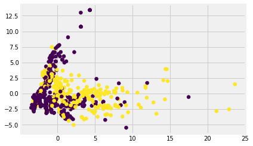


#### 4.1.3-lda
lda是一种线性的有监督降维方式，与pca的最大化方差的目标不同，它的目标是找到这样的新坐标轴：**同类样例的投影尽可能近，异类样例的投影点尽可能远**；  
更多：https://blog.csdn.net/weixin_40604987/article/details/79615968


```python
from sklearn.discriminant_analysis  import LinearDiscriminantAnalysis
kfold= KFold(n_splits=5,random_state=42,shuffle=True)
scores=[]
standard_np=StandardScaler().fit_transform(features_select_top_50_df)
for train_index,test_index in kfold.split(standard_np[:891],labels):
    X_train=standard_np[train_index]
    y_train=labels[train_index]
    X_test=standard_np[test_index]
    y_test=labels[test_index]
    
    lda=LinearDiscriminantAnalysis(n_components=20)
    lda.fit(X_train, y_train)
    
    X_new_train=lda.transform(X_train)
    X_new_test=lda.transform(X_test)
    
    gbdt=GradientBoostingClassifier()
    gbdt.fit(X_new_train,y_train)
    y_predict=gbdt.predict(X_new_test)
    f1_score=metrics.f1_score(y_test,y_predict)
    scores.append(f1_score)
np.mean(scores),np.std(scores)
```


    (0.7460656054841958, 0.042041162734238115)


```python
plt.scatter(X_new_train[:891][:, 0], X_new_train[:891][:, 0],marker='o',c=y_train)
plt.show()
```


#### 4.1.3 lle-局部线性嵌入（LocallyLinearEmbedding）
降维时保持样本局部的线性特征

更多：https://www.cnblogs.com/pinard/p/6266408.html?utm_source=itdadao&utm_medium=referral


```python
from sklearn.manifold import LocallyLinearEmbedding
standard_df=StandardScaler().fit_transform(features_select_top_50_df)
X_lle=LocallyLinearEmbedding(n_components=20).fit_transform(standard_df)
```


```python
#gbdt
classifier=GradientBoostingClassifier()
scores = cross_val_score(classifier,X_lle[:891], labels, scoring='f1', cv = 5)
np.mean(scores),np.std(scores)
```


    (0.7593378531368846, 0.03120998584387323)


```python
plt.scatter(X_lle[:891][:, 0], X_lle[:891][:, 1],marker='o',c=labels)
plt.show()
```


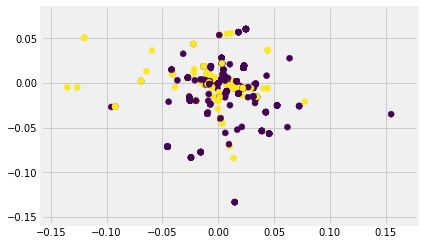


#### 4.1.4 ae-自编码
预测目标就是输入目标，可以把它看做一个压缩和解压的过程，如下，通过encoder把一个高维的数据压缩为低维的数据，通过decoder将低维数据还原为高维的数据，这样这个低维的数据可以看做高维数据的一种“不失真”表示；    

ae在图像和nlp方面都有很多深入的应用，比如cv中的vae，nlp中的bert等...  
更多：https://blog.csdn.net/leida_wt/article/details/85052299


```python
from keras.models import Model
from keras.layers import *
# 指定显卡
import os
os.environ['CUDA_VISIBLE_DEVICES']='0'
# 动态申请显存
import keras.backend.tensorflow_backend as KTF
import tensorflow as tf

config = tf.ConfigProto()
config.gpu_options.allow_growth = True  # 不全部占满显存, 按需分配
sess = tf.Session(config=config)
KTF.set_session(sess)
```

    Using TensorFlow backend.
    


```python
#定义网络结构
epochs=200
batch_size=128
input_dim=50

input_layer=Input(shape=(input_dim,))
encode_layer=Dense(2,activation='relu',name='encoder')(input_layer)
decode_layer=Dense(input_dim,activation='tanh')(encode_layer)

model=Model(inputs=input_layer,outputs=decode_layer)
#获取encode_layer层的输出
encode_layer_model = Model(inputs=model.input,outputs=model.get_layer('encoder').output)
model.compile('adam',loss='mse')
```


```python
#预处理输入数据
ae_standard_np=StandardScaler().fit_transform(features_select_top_50_df)
```


```python
X_train=ae_standard_np[:1200]
X_eval=ae_standard_np[1200:]
```


```python
X_train.shape,X_eval.shape
```


    ((1200, 50), (109, 50))


```python
#训练模型
model.fit(X_train,X_train,batch_size=batch_size,epochs=epochs,validation_data=[X_eval,X_eval])
```

    Train on 1200 samples, validate on 109 samples
    Epoch 1/200
    1200/1200 [==============================] - 0s 284us/step - loss: 1.0289 - val_loss: 1.2741
    Epoch 2/200
    1200/1200 [==============================] - 0s 20us/step - loss: 1.0130 - val_loss: 1.2590
    Epoch 3/200
    1200/1200 [==============================] - 0s 21us/step - loss: 1.0011 - val_loss: 1.2474
    Epoch 4/200
    1200/1200 [==============================] - 0s 21us/step - loss: 0.9924 - val_loss: 1.2385
    Epoch 5/200
    1200/1200 [==============================] - 0s 21us/step - loss: 0.9857 - val_loss: 1.2318
    Epoch 6/200
    1200/1200 [==============================] - 0s 21us/step - loss: 0.9803 - val_loss: 1.2251
    Epoch 7/200
    1200/1200 [==============================] - 0s 21us/step - loss: 0.9753 - val_loss: 1.2163
    Epoch 8/200
    1200/1200 [==============================] - 0s 20us/step - loss: 0.9705 - val_loss: 1.2051
    Epoch 9/200
    1200/1200 [==============================] - 0s 21us/step - loss: 0.9649 - val_loss: 1.1930
    Epoch 10/200
    1200/1200 [==============================] - 0s 20us/step - loss: 0.9583 - val_loss: 1.1792
    Epoch 11/200
    1200/1200 [==============================] - 0s 20us/step - loss: 0.9509 - val_loss: 1.1640
    Epoch 12/200
    1200/1200 [==============================] - 0s 18us/step - loss: 0.9421 - val_loss: 1.1486
    Epoch 13/200
    1200/1200 [==============================] - 0s 19us/step - loss: 0.9314 - val_loss: 1.1329
    Epoch 14/200
    1200/1200 [==============================] - 0s 21us/step - loss: 0.9196 - val_loss: 1.1160
    Epoch 15/200
    1200/1200 [==============================] - 0s 20us/step - loss: 0.9059 - val_loss: 1.0999
    Epoch 16/200
    1200/1200 [==============================] - 0s 19us/step - loss: 0.8922 - val_loss: 1.0837
    Epoch 17/200
    1200/1200 [==============================] - 0s 23us/step - loss: 0.8778 - val_loss: 1.0688
    Epoch 18/200
    1200/1200 [==============================] - 0s 20us/step - loss: 0.8636 - val_loss: 1.0544
    Epoch 19/200
    1200/1200 [==============================] - 0s 19us/step - loss: 0.8501 - val_loss: 1.0406
    Epoch 20/200
    1200/1200 [==============================] - 0s 20us/step - loss: 0.8373 - val_loss: 1.0274
    Epoch 21/200
    1200/1200 [==============================] - 0s 20us/step - loss: 0.8253 - val_loss: 1.0156
    Epoch 22/200
    1200/1200 [==============================] - 0s 19us/step - loss: 0.8141 - val_loss: 1.0053
    Epoch 23/200
    1200/1200 [==============================] - 0s 19us/step - loss: 0.8038 - val_loss: 0.9969
    Epoch 24/200
    1200/1200 [==============================] - 0s 21us/step - loss: 0.7946 - val_loss: 0.9902
    Epoch 25/200
    1200/1200 [==============================] - 0s 20us/step - loss: 0.7867 - val_loss: 0.9851
    Epoch 26/200
    1200/1200 [==============================] - 0s 21us/step - loss: 0.7796 - val_loss: 0.9811
    Epoch 27/200
    1200/1200 [==============================] - 0s 20us/step - loss: 0.7740 - val_loss: 0.9779
    Epoch 28/200
    1200/1200 [==============================] - 0s 22us/step - loss: 0.7690 - val_loss: 0.9753
    Epoch 29/200
    1200/1200 [==============================] - 0s 20us/step - loss: 0.7647 - val_loss: 0.9733
    Epoch 30/200
    1200/1200 [==============================] - 0s 22us/step - loss: 0.7611 - val_loss: 0.9717
    Epoch 31/200
    1200/1200 [==============================] - 0s 19us/step - loss: 0.7579 - val_loss: 0.9701
    Epoch 32/200
    1200/1200 [==============================] - 0s 22us/step - loss: 0.7549 - val_loss: 0.9686
    Epoch 33/200
    1200/1200 [==============================] - 0s 19us/step - loss: 0.7523 - val_loss: 0.9673
    Epoch 34/200
    1200/1200 [==============================] - 0s 21us/step - loss: 0.7497 - val_loss: 0.9660
    Epoch 35/200
    1200/1200 [==============================] - 0s 19us/step - loss: 0.7473 - val_loss: 0.9648
    Epoch 36/200
    1200/1200 [==============================] - 0s 21us/step - loss: 0.7449 - val_loss: 0.9630
    Epoch 37/200
    1200/1200 [==============================] - 0s 20us/step - loss: 0.7424 - val_loss: 0.9611
    Epoch 38/200
    1200/1200 [==============================] - 0s 20us/step - loss: 0.7400 - val_loss: 0.9593
    Epoch 39/200
    1200/1200 [==============================] - 0s 18us/step - loss: 0.7374 - val_loss: 0.9577
    Epoch 40/200
    1200/1200 [==============================] - 0s 19us/step - loss: 0.7351 - val_loss: 0.9560
    Epoch 41/200
    1200/1200 [==============================] - 0s 18us/step - loss: 0.7329 - val_loss: 0.9544
    Epoch 42/200
    1200/1200 [==============================] - 0s 23us/step - loss: 0.7307 - val_loss: 0.9528
    Epoch 43/200
    1200/1200 [==============================] - 0s 18us/step - loss: 0.7285 - val_loss: 0.9511
    Epoch 44/200
    1200/1200 [==============================] - 0s 19us/step - loss: 0.7264 - val_loss: 0.9495
    Epoch 45/200
    1200/1200 [==============================] - 0s 19us/step - loss: 0.7244 - val_loss: 0.9481
    Epoch 46/200
    1200/1200 [==============================] - 0s 19us/step - loss: 0.7225 - val_loss: 0.9466
    Epoch 47/200
    1200/1200 [==============================] - 0s 19us/step - loss: 0.7205 - val_loss: 0.9449
    Epoch 48/200
    1200/1200 [==============================] - 0s 20us/step - loss: 0.7187 - val_loss: 0.9433
    Epoch 49/200
    1200/1200 [==============================] - 0s 18us/step - loss: 0.7169 - val_loss: 0.9419
    Epoch 50/200
    1200/1200 [==============================] - 0s 19us/step - loss: 0.7152 - val_loss: 0.9405
    Epoch 51/200
    1200/1200 [==============================] - 0s 20us/step - loss: 0.7136 - val_loss: 0.9393
    Epoch 52/200
    1200/1200 [==============================] - 0s 21us/step - loss: 0.7121 - val_loss: 0.9381
    Epoch 53/200
    1200/1200 [==============================] - 0s 18us/step - loss: 0.7106 - val_loss: 0.9369
    Epoch 54/200
    1200/1200 [==============================] - 0s 20us/step - loss: 0.7092 - val_loss: 0.9356
    Epoch 55/200
    1200/1200 [==============================] - 0s 19us/step - loss: 0.7079 - val_loss: 0.9343
    Epoch 56/200
    1200/1200 [==============================] - 0s 20us/step - loss: 0.7066 - val_loss: 0.9333
    Epoch 57/200
    1200/1200 [==============================] - 0s 18us/step - loss: 0.7054 - val_loss: 0.9325
    Epoch 58/200
    1200/1200 [==============================] - 0s 19us/step - loss: 0.7042 - val_loss: 0.9316
    Epoch 59/200
    1200/1200 [==============================] - 0s 19us/step - loss: 0.7031 - val_loss: 0.9308
    Epoch 60/200
    1200/1200 [==============================] - 0s 20us/step - loss: 0.7021 - val_loss: 0.9300
    Epoch 61/200
    1200/1200 [==============================] - 0s 20us/step - loss: 0.7011 - val_loss: 0.9289
    Epoch 62/200
    1200/1200 [==============================] - 0s 19us/step - loss: 0.7002 - val_loss: 0.9278
    Epoch 63/200
    1200/1200 [==============================] - 0s 20us/step - loss: 0.6993 - val_loss: 0.9269
    Epoch 64/200
    1200/1200 [==============================] - 0s 19us/step - loss: 0.6984 - val_loss: 0.9263
    Epoch 65/200
    1200/1200 [==============================] - 0s 23us/step - loss: 0.6976 - val_loss: 0.9257
    Epoch 66/200
    1200/1200 [==============================] - 0s 21us/step - loss: 0.6968 - val_loss: 0.9252
    Epoch 67/200
    1200/1200 [==============================] - 0s 23us/step - loss: 0.6960 - val_loss: 0.9244
    Epoch 68/200
    1200/1200 [==============================] - 0s 21us/step - loss: 0.6951 - val_loss: 0.9237
    Epoch 69/200
    1200/1200 [==============================] - 0s 22us/step - loss: 0.6944 - val_loss: 0.9231
    Epoch 70/200
    1200/1200 [==============================] - 0s 19us/step - loss: 0.6936 - val_loss: 0.9228
    Epoch 71/200
    1200/1200 [==============================] - ETA: 0s - loss: 0.757 - 0s 20us/step - loss: 0.6929 - val_loss: 0.9217
    Epoch 72/200
    1200/1200 [==============================] - 0s 20us/step - loss: 0.6922 - val_loss: 0.9208
    Epoch 73/200
    1200/1200 [==============================] - 0s 19us/step - loss: 0.6915 - val_loss: 0.9202
    Epoch 74/200
    1200/1200 [==============================] - 0s 18us/step - loss: 0.6907 - val_loss: 0.9196
    Epoch 75/200
    1200/1200 [==============================] - 0s 19us/step - loss: 0.6901 - val_loss: 0.9191
    Epoch 76/200
    1200/1200 [==============================] - 0s 20us/step - loss: 0.6894 - val_loss: 0.9184
    Epoch 77/200
    1200/1200 [==============================] - 0s 21us/step - loss: 0.6887 - val_loss: 0.9179
    Epoch 78/200
    1200/1200 [==============================] - 0s 21us/step - loss: 0.6880 - val_loss: 0.9173
    Epoch 79/200
    1200/1200 [==============================] - 0s 22us/step - loss: 0.6875 - val_loss: 0.9169
    Epoch 80/200
    1200/1200 [==============================] - 0s 18us/step - loss: 0.6868 - val_loss: 0.9163
    Epoch 81/200
    1200/1200 [==============================] - 0s 20us/step - loss: 0.6862 - val_loss: 0.9160
    Epoch 82/200
    1200/1200 [==============================] - 0s 19us/step - loss: 0.6857 - val_loss: 0.9156
    Epoch 83/200
    1200/1200 [==============================] - 0s 20us/step - loss: 0.6851 - val_loss: 0.9152
    Epoch 84/200
    1200/1200 [==============================] - 0s 19us/step - loss: 0.6846 - val_loss: 0.9150
    Epoch 85/200
    1200/1200 [==============================] - 0s 19us/step - loss: 0.6841 - val_loss: 0.9148
    Epoch 86/200
    1200/1200 [==============================] - 0s 19us/step - loss: 0.6836 - val_loss: 0.9143
    Epoch 87/200
    1200/1200 [==============================] - 0s 19us/step - loss: 0.6832 - val_loss: 0.9140
    Epoch 88/200
    1200/1200 [==============================] - 0s 19us/step - loss: 0.6828 - val_loss: 0.9136
    Epoch 89/200
    1200/1200 [==============================] - 0s 18us/step - loss: 0.6824 - val_loss: 0.9132
    Epoch 90/200
    1200/1200 [==============================] - 0s 20us/step - loss: 0.6819 - val_loss: 0.9127
    Epoch 91/200
    1200/1200 [==============================] - 0s 19us/step - loss: 0.6816 - val_loss: 0.9125
    Epoch 92/200
    1200/1200 [==============================] - 0s 18us/step - loss: 0.6812 - val_loss: 0.9120
    Epoch 93/200
    1200/1200 [==============================] - 0s 18us/step - loss: 0.6808 - val_loss: 0.9117
    Epoch 94/200
    1200/1200 [==============================] - 0s 20us/step - loss: 0.6805 - val_loss: 0.9111
    Epoch 95/200
    1200/1200 [==============================] - 0s 20us/step - loss: 0.6801 - val_loss: 0.9110
    Epoch 96/200
    1200/1200 [==============================] - 0s 19us/step - loss: 0.6798 - val_loss: 0.9107
    Epoch 97/200
    1200/1200 [==============================] - 0s 20us/step - loss: 0.6795 - val_loss: 0.9107
    Epoch 98/200
    1200/1200 [==============================] - 0s 19us/step - loss: 0.6791 - val_loss: 0.9107
    Epoch 99/200
    1200/1200 [==============================] - 0s 19us/step - loss: 0.6788 - val_loss: 0.9102
    Epoch 100/200
    1200/1200 [==============================] - 0s 20us/step - loss: 0.6784 - val_loss: 0.9100
    Epoch 101/200
    1200/1200 [==============================] - 0s 19us/step - loss: 0.6781 - val_loss: 0.9097
    Epoch 102/200
    1200/1200 [==============================] - 0s 20us/step - loss: 0.6777 - val_loss: 0.9094
    Epoch 103/200
    1200/1200 [==============================] - 0s 18us/step - loss: 0.6773 - val_loss: 0.9087
    Epoch 104/200
    1200/1200 [==============================] - 0s 19us/step - loss: 0.6768 - val_loss: 0.9080
    Epoch 105/200
    1200/1200 [==============================] - 0s 20us/step - loss: 0.6763 - val_loss: 0.9074
    Epoch 106/200
    1200/1200 [==============================] - 0s 20us/step - loss: 0.6758 - val_loss: 0.9064
    Epoch 107/200
    1200/1200 [==============================] - 0s 19us/step - loss: 0.6753 - val_loss: 0.9056
    Epoch 108/200
    1200/1200 [==============================] - 0s 19us/step - loss: 0.6749 - val_loss: 0.9048
    Epoch 109/200
    1200/1200 [==============================] - 0s 18us/step - loss: 0.6743 - val_loss: 0.9037
    Epoch 110/200
    1200/1200 [==============================] - 0s 18us/step - loss: 0.6739 - val_loss: 0.9028
    Epoch 111/200
    1200/1200 [==============================] - 0s 18us/step - loss: 0.6735 - val_loss: 0.9021
    Epoch 112/200
    1200/1200 [==============================] - 0s 18us/step - loss: 0.6731 - val_loss: 0.9015
    Epoch 113/200
    1200/1200 [==============================] - 0s 18us/step - loss: 0.6727 - val_loss: 0.9010
    Epoch 114/200
    1200/1200 [==============================] - 0s 20us/step - loss: 0.6724 - val_loss: 0.9005
    Epoch 115/200
    1200/1200 [==============================] - 0s 20us/step - loss: 0.6720 - val_loss: 0.9000
    Epoch 116/200
    1200/1200 [==============================] - 0s 20us/step - loss: 0.6717 - val_loss: 0.8995
    Epoch 117/200
    1200/1200 [==============================] - 0s 18us/step - loss: 0.6714 - val_loss: 0.8995
    Epoch 118/200
    1200/1200 [==============================] - 0s 18us/step - loss: 0.6711 - val_loss: 0.8990
    Epoch 119/200
    1200/1200 [==============================] - 0s 18us/step - loss: 0.6709 - val_loss: 0.8990
    Epoch 120/200
    1200/1200 [==============================] - 0s 18us/step - loss: 0.6706 - val_loss: 0.8986
    Epoch 121/200
    1200/1200 [==============================] - 0s 19us/step - loss: 0.6703 - val_loss: 0.8983
    Epoch 122/200
    1200/1200 [==============================] - 0s 18us/step - loss: 0.6701 - val_loss: 0.8980
    Epoch 123/200
    1200/1200 [==============================] - 0s 19us/step - loss: 0.6699 - val_loss: 0.8978
    Epoch 124/200
    1200/1200 [==============================] - 0s 20us/step - loss: 0.6697 - val_loss: 0.8975
    Epoch 125/200
    1200/1200 [==============================] - 0s 19us/step - loss: 0.6695 - val_loss: 0.8972
    Epoch 126/200
    1200/1200 [==============================] - 0s 18us/step - loss: 0.6692 - val_loss: 0.8970
    Epoch 127/200
    1200/1200 [==============================] - 0s 19us/step - loss: 0.6690 - val_loss: 0.8967
    Epoch 128/200
    1200/1200 [==============================] - 0s 19us/step - loss: 0.6688 - val_loss: 0.8963
    Epoch 129/200
    1200/1200 [==============================] - 0s 19us/step - loss: 0.6686 - val_loss: 0.8961
    Epoch 130/200
    1200/1200 [==============================] - 0s 18us/step - loss: 0.6684 - val_loss: 0.8959
    Epoch 131/200
    1200/1200 [==============================] - 0s 20us/step - loss: 0.6682 - val_loss: 0.8958
    Epoch 132/200
    1200/1200 [==============================] - 0s 19us/step - loss: 0.6680 - val_loss: 0.8957
    Epoch 133/200
    1200/1200 [==============================] - 0s 20us/step - loss: 0.6678 - val_loss: 0.8956
    Epoch 134/200
    1200/1200 [==============================] - 0s 18us/step - loss: 0.6676 - val_loss: 0.8952
    Epoch 135/200
    1200/1200 [==============================] - 0s 18us/step - loss: 0.6674 - val_loss: 0.8948
    Epoch 136/200
    1200/1200 [==============================] - 0s 19us/step - loss: 0.6672 - val_loss: 0.8948
    Epoch 137/200
    1200/1200 [==============================] - 0s 19us/step - loss: 0.6670 - val_loss: 0.8947
    Epoch 138/200
    1200/1200 [==============================] - 0s 19us/step - loss: 0.6669 - val_loss: 0.8945
    Epoch 139/200
    1200/1200 [==============================] - 0s 20us/step - loss: 0.6667 - val_loss: 0.8944
    Epoch 140/200
    1200/1200 [==============================] - 0s 19us/step - loss: 0.6665 - val_loss: 0.8942
    Epoch 141/200
    1200/1200 [==============================] - 0s 18us/step - loss: 0.6663 - val_loss: 0.8939
    Epoch 142/200
    1200/1200 [==============================] - 0s 21us/step - loss: 0.6662 - val_loss: 0.8936
    Epoch 143/200
    1200/1200 [==============================] - 0s 19us/step - loss: 0.6660 - val_loss: 0.8934
    Epoch 144/200
    1200/1200 [==============================] - 0s 19us/step - loss: 0.6659 - val_loss: 0.8930
    Epoch 145/200
    1200/1200 [==============================] - 0s 19us/step - loss: 0.6658 - val_loss: 0.8931
    Epoch 146/200
    1200/1200 [==============================] - 0s 18us/step - loss: 0.6656 - val_loss: 0.8928
    Epoch 147/200
    1200/1200 [==============================] - 0s 19us/step - loss: 0.6654 - val_loss: 0.8927
    Epoch 148/200
    1200/1200 [==============================] - 0s 19us/step - loss: 0.6653 - val_loss: 0.8923
    Epoch 149/200
    1200/1200 [==============================] - 0s 19us/step - loss: 0.6652 - val_loss: 0.8922
    Epoch 150/200
    1200/1200 [==============================] - 0s 19us/step - loss: 0.6650 - val_loss: 0.8922
    Epoch 151/200
    1200/1200 [==============================] - 0s 19us/step - loss: 0.6649 - val_loss: 0.8923
    Epoch 152/200
    1200/1200 [==============================] - 0s 18us/step - loss: 0.6647 - val_loss: 0.8922
    Epoch 153/200
    1200/1200 [==============================] - 0s 18us/step - loss: 0.6646 - val_loss: 0.8921
    Epoch 154/200
    1200/1200 [==============================] - 0s 19us/step - loss: 0.6645 - val_loss: 0.8917
    Epoch 155/200
    1200/1200 [==============================] - 0s 20us/step - loss: 0.6644 - val_loss: 0.8916
    Epoch 156/200
    1200/1200 [==============================] - 0s 20us/step - loss: 0.6642 - val_loss: 0.8915
    Epoch 157/200
    1200/1200 [==============================] - 0s 19us/step - loss: 0.6641 - val_loss: 0.8913
    Epoch 158/200
    1200/1200 [==============================] - 0s 19us/step - loss: 0.6640 - val_loss: 0.8917
    Epoch 159/200
    1200/1200 [==============================] - 0s 18us/step - loss: 0.6639 - val_loss: 0.8914
    Epoch 160/200
    1200/1200 [==============================] - 0s 18us/step - loss: 0.6638 - val_loss: 0.8909
    Epoch 161/200
    1200/1200 [==============================] - 0s 19us/step - loss: 0.6637 - val_loss: 0.8911
    Epoch 162/200
    1200/1200 [==============================] - 0s 20us/step - loss: 0.6636 - val_loss: 0.8911
    Epoch 163/200
    1200/1200 [==============================] - 0s 18us/step - loss: 0.6635 - val_loss: 0.8911
    Epoch 164/200
    1200/1200 [==============================] - 0s 19us/step - loss: 0.6633 - val_loss: 0.8910
    Epoch 165/200
    1200/1200 [==============================] - 0s 18us/step - loss: 0.6632 - val_loss: 0.8910
    Epoch 166/200
    1200/1200 [==============================] - 0s 19us/step - loss: 0.6632 - val_loss: 0.8908
    Epoch 167/200
    1200/1200 [==============================] - 0s 19us/step - loss: 0.6630 - val_loss: 0.8909
    Epoch 168/200
    1200/1200 [==============================] - 0s 20us/step - loss: 0.6629 - val_loss: 0.8908
    Epoch 169/200
    1200/1200 [==============================] - 0s 19us/step - loss: 0.6628 - val_loss: 0.8907
    Epoch 170/200
    1200/1200 [==============================] - 0s 19us/step - loss: 0.6628 - val_loss: 0.8904
    Epoch 171/200
    1200/1200 [==============================] - 0s 20us/step - loss: 0.6627 - val_loss: 0.8905
    Epoch 172/200
    1200/1200 [==============================] - 0s 18us/step - loss: 0.6626 - val_loss: 0.8905
    Epoch 173/200
    1200/1200 [==============================] - 0s 19us/step - loss: 0.6625 - val_loss: 0.8904
    Epoch 174/200
    1200/1200 [==============================] - 0s 18us/step - loss: 0.6624 - val_loss: 0.8906
    Epoch 175/200
    1200/1200 [==============================] - 0s 20us/step - loss: 0.6624 - val_loss: 0.8906
    Epoch 176/200
    1200/1200 [==============================] - 0s 18us/step - loss: 0.6623 - val_loss: 0.8903
    Epoch 177/200
    1200/1200 [==============================] - 0s 20us/step - loss: 0.6622 - val_loss: 0.8902
    Epoch 178/200
    1200/1200 [==============================] - 0s 19us/step - loss: 0.6621 - val_loss: 0.8903
    Epoch 179/200
    1200/1200 [==============================] - 0s 20us/step - loss: 0.6620 - val_loss: 0.8902
    Epoch 180/200
    1200/1200 [==============================] - 0s 20us/step - loss: 0.6619 - val_loss: 0.8899
    Epoch 181/200
    1200/1200 [==============================] - 0s 19us/step - loss: 0.6618 - val_loss: 0.8901
    Epoch 182/200
    1200/1200 [==============================] - 0s 19us/step - loss: 0.6617 - val_loss: 0.8900
    Epoch 183/200
    1200/1200 [==============================] - 0s 19us/step - loss: 0.6616 - val_loss: 0.8902
    Epoch 184/200
    1200/1200 [==============================] - 0s 18us/step - loss: 0.6616 - val_loss: 0.8903
    Epoch 185/200
    1200/1200 [==============================] - 0s 19us/step - loss: 0.6615 - val_loss: 0.8905
    Epoch 186/200
    1200/1200 [==============================] - 0s 18us/step - loss: 0.6614 - val_loss: 0.8907
    Epoch 187/200
    1200/1200 [==============================] - 0s 19us/step - loss: 0.6613 - val_loss: 0.8906
    Epoch 188/200
    1200/1200 [==============================] - 0s 18us/step - loss: 0.6612 - val_loss: 0.8904
    Epoch 189/200
    1200/1200 [==============================] - 0s 20us/step - loss: 0.6612 - val_loss: 0.8902
    Epoch 190/200
    1200/1200 [==============================] - 0s 19us/step - loss: 0.6611 - val_loss: 0.8899
    Epoch 191/200
    1200/1200 [==============================] - 0s 19us/step - loss: 0.6611 - val_loss: 0.8897
    Epoch 192/200
    1200/1200 [==============================] - 0s 19us/step - loss: 0.6610 - val_loss: 0.8899
    Epoch 193/200
    1200/1200 [==============================] - 0s 18us/step - loss: 0.6609 - val_loss: 0.8897
    Epoch 194/200
    1200/1200 [==============================] - 0s 19us/step - loss: 0.6608 - val_loss: 0.8895
    Epoch 195/200
    1200/1200 [==============================] - 0s 19us/step - loss: 0.6608 - val_loss: 0.8894
    Epoch 196/200
    1200/1200 [==============================] - 0s 19us/step - loss: 0.6607 - val_loss: 0.8894
    Epoch 197/200
    1200/1200 [==============================] - 0s 19us/step - loss: 0.6606 - val_loss: 0.8897
    Epoch 198/200
    1200/1200 [==============================] - 0s 20us/step - loss: 0.6606 - val_loss: 0.8897
    Epoch 199/200
    1200/1200 [==============================] - 0s 19us/step - loss: 0.6605 - val_loss: 0.8894
    Epoch 200/200
    1200/1200 [==============================] - 0s 20us/step - loss: 0.6604 - val_loss: 0.8893
    


    <keras.callbacks.History at 0x27645f333c8>


```python
X_eval[0]
```


    array([-0.05346571,  1.07885292,  1.45989574, -0.31540135,  2.41822112,
           -0.30134655, -0.35524414, -0.31508197,  2.25949286, -0.22137801,
            0.87936559,  2.24948554,  0.36739393, -0.18690475,  0.36795947,
            1.93572254,  0.77516707, -0.35569965, -0.3347291 ,  1.68030492,
           -0.19883136,  1.06873154,  0.34181263, -0.37098818, -0.09205746,
           -0.20537302,  0.823777  , -0.19815661, -0.22115082,  0.84191642,
            1.03692279, -0.19660805, -0.10208177, -0.11772483, -0.05586586,
            0.60720133,  0.02367394, -0.20716782, -0.18598453, -0.24990615,
            0.47486479, -0.08320503,  2.20879186,  0.48775033, -0.15412406,
            1.42880154, -0.11772483,  1.78130624, -0.20339208,  2.21576743])


```python
model.predict(X_eval)[0]
```


    array([-0.0801675 ,  0.07296682,  0.41939336, -0.24811772, -0.03432285,
           -0.10558274, -0.28374588, -0.39323986, -0.0539648 , -0.40869796,
            0.69578105,  0.7121193 , -0.5070763 , -0.14108536,  0.23965408,
            0.74424994,  0.25377718, -0.3518952 ,  0.502023  ,  0.6239335 ,
            0.32818064, -0.34520072,  0.59817564, -0.3514654 , -0.24084517,
           -0.4016987 , -0.02132083,  0.1887731 , -0.4175932 ,  0.6987827 ,
           -0.7171223 ,  0.02379587,  0.18329269,  0.07201558,  0.26122534,
            0.592915  , -0.47993666, -0.24775195, -0.4004705 , -0.0052062 ,
           -0.5650685 , -0.237046  ,  0.43315473, -0.56589836, -0.2872388 ,
           -0.60540956,  0.07213464, -0.7194849 ,  0.092356  ,  0.41038588],
          dtype=float32)


```python
encode_layer_model.predict(X_eval)[0]
```


    array([0.22013885, 0.        ], dtype=float32)


```python
np.mean(X_eval-model.predict(X_eval)),np.std(X_eval-model.predict(X_eval))
```


    (0.06454085580063489, 0.940818802140507)


```python
ae_new_features=encode_layer_model.predict(ae_standard_np)
```


```python
ae_new_features.shape
```


    (1309, 2)


```python
#gbdt
classifier=GradientBoostingClassifier()
scores = cross_val_score(classifier,ae_new_features[:891], labels, scoring='f1', cv = 5)
np.mean(scores),np.std(scores)
```


    (0.6325610416519508, 0.06452637259580173)


```python
plt.scatter(ae_new_features[:891][:, 0], ae_new_features[:891][:, 1],marker='o',c=labels)
plt.show()
```


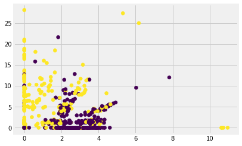


特征转换似乎都不能提高效果

##### 特征增强总结
特征增强很关键，是后续操作的基础，其实最有用的在于造出make sense的特征，从之前的操作来看我们造了几个make sense的特征就立即把模型从0.77+提升到了0.78+，而通过后续一系列的复杂特征变换（聚类、交互特征、特征选择...）才从0.78+提升到0.79+，接下来我们在features_select_top_50_df基础上尝试一些数据增强的方式；  

#### 4.2 数据增强
提供更多数据给模型训练，可从两方面来考虑：  

（1）利用其余的未标记数据进行无监督学习，在我们的标记数据进行监督学习（半监督学习），比如nlp任务中收集海量的文本数据训练embedding，然后再在其他nlp任务上做fine tuning；  
（2）在当前数据的基础上造出相似的数据，比如nlp任务中删除某一个词、替换同义词...，cv任务中缩放、旋转、翻转图片、gan...

##### 4.2.1 数据增强-半监督学习
这里没有多余的feature数据，我们假设test部分就是多出来的部分；  

在pca上做对比...


```python
#增强前
standard_df=StandardScaler().fit_transform(features_select_top_50_df[:891])
X_pca=PCA(n_components=20).fit_transform(standard_df)
#gbdt
classifier=GradientBoostingClassifier()
scores = cross_val_score(classifier,X_pca, labels, scoring='f1', cv = 5)
np.mean(scores),np.std(scores)
```


    (0.7728644604211258, 0.03638365981891742)


```python
#增强后
standard_df=StandardScaler().fit_transform(features_select_top_50_df)
X_pca=PCA(n_components=20).fit_transform(standard_df)
#gbdt
classifier=GradientBoostingClassifier()
scores = cross_val_score(classifier,X_pca[:891], labels, scoring='f1', cv = 5)
np.mean(scores),np.std(scores)
```


    (0.7643321822324359, 0.025163060923998136)


在ae上对比...


```python
#增强前
#定义网络结构
epochs=200
batch_size=128
input_dim=50

input_layer=Input(shape=(input_dim,))
encode_layer=Dense(20,activation='relu',name='encoder')(input_layer)
decode_layer=Dense(input_dim,activation='tanh')(encode_layer)

model=Model(inputs=input_layer,outputs=decode_layer)
#获取encode_layer层的输出
encode_layer_model = Model(inputs=model.input,outputs=model.get_layer('encoder').output)
model.compile('adam',loss='mse')

ae_standard_np=StandardScaler().fit_transform(features_select_top_50_df[:891])
X_train=ae_standard_np[:750]
X_eval=ae_standard_np[750:]

#训练模型
model.fit(X_train,X_train,batch_size=batch_size,epochs=epochs,validation_data=[X_eval,X_eval])
ae_new_features=encode_layer_model.predict(ae_standard_np)
#gbdt
classifier=GradientBoostingClassifier()
scores = cross_val_score(classifier,ae_new_features, labels, scoring='f1', cv = 5)
np.mean(scores),np.std(scores)
```

    Train on 750 samples, validate on 141 samples
    Epoch 1/200
    750/750 [==============================] - 0s 238us/step - loss: 1.1226 - val_loss: 1.1079
    Epoch 2/200
    750/750 [==============================] - 0s 24us/step - loss: 1.0751 - val_loss: 1.0638
    Epoch 3/200
    750/750 [==============================] - 0s 24us/step - loss: 1.0310 - val_loss: 1.0241
    Epoch 4/200
    750/750 [==============================] - 0s 21us/step - loss: 0.9912 - val_loss: 0.9889
    Epoch 5/200
    750/750 [==============================] - 0s 23us/step - loss: 0.9543 - val_loss: 0.9559
    Epoch 6/200
    750/750 [==============================] - 0s 21us/step - loss: 0.9204 - val_loss: 0.9242
    Epoch 7/200
    750/750 [==============================] - 0s 25us/step - loss: 0.8892 - val_loss: 0.8936
    Epoch 8/200
    750/750 [==============================] - 0s 21us/step - loss: 0.8588 - val_loss: 0.8638
    Epoch 9/200
    750/750 [==============================] - 0s 23us/step - loss: 0.8307 - val_loss: 0.8349
    Epoch 10/200
    750/750 [==============================] - 0s 23us/step - loss: 0.8027 - val_loss: 0.8068
    Epoch 11/200
    750/750 [==============================] - 0s 21us/step - loss: 0.7762 - val_loss: 0.7797
    Epoch 12/200
    750/750 [==============================] - 0s 25us/step - loss: 0.7523 - val_loss: 0.7547
    Epoch 13/200
    750/750 [==============================] - 0s 23us/step - loss: 0.7292 - val_loss: 0.7329
    Epoch 14/200
    750/750 [==============================] - 0s 23us/step - loss: 0.7085 - val_loss: 0.7135
    Epoch 15/200
    750/750 [==============================] - 0s 23us/step - loss: 0.6892 - val_loss: 0.6966
    Epoch 16/200
    750/750 [==============================] - 0s 21us/step - loss: 0.6707 - val_loss: 0.6820
    Epoch 17/200
    750/750 [==============================] - 0s 28us/step - loss: 0.6546 - val_loss: 0.6693
    Epoch 18/200
    750/750 [==============================] - 0s 21us/step - loss: 0.6411 - val_loss: 0.6581
    Epoch 19/200
    750/750 [==============================] - 0s 23us/step - loss: 0.6297 - val_loss: 0.6479
    Epoch 20/200
    750/750 [==============================] - 0s 23us/step - loss: 0.6195 - val_loss: 0.6387
    Epoch 21/200
    750/750 [==============================] - 0s 21us/step - loss: 0.6103 - val_loss: 0.6304
    Epoch 22/200
    750/750 [==============================] - 0s 25us/step - loss: 0.6021 - val_loss: 0.6228
    Epoch 23/200
    750/750 [==============================] - 0s 23us/step - loss: 0.5945 - val_loss: 0.6158
    Epoch 24/200
    750/750 [==============================] - 0s 24us/step - loss: 0.5877 - val_loss: 0.6092
    Epoch 25/200
    750/750 [==============================] - 0s 21us/step - loss: 0.5814 - val_loss: 0.6031
    Epoch 26/200
    750/750 [==============================] - 0s 21us/step - loss: 0.5756 - val_loss: 0.5972
    Epoch 27/200
    750/750 [==============================] - 0s 24us/step - loss: 0.5702 - val_loss: 0.5918
    Epoch 28/200
    750/750 [==============================] - 0s 24us/step - loss: 0.5652 - val_loss: 0.5864
    Epoch 29/200
    750/750 [==============================] - 0s 20us/step - loss: 0.5604 - val_loss: 0.5811
    Epoch 30/200
    750/750 [==============================] - 0s 23us/step - loss: 0.5558 - val_loss: 0.5757
    Epoch 31/200
    750/750 [==============================] - 0s 20us/step - loss: 0.5514 - val_loss: 0.5702
    Epoch 32/200
    750/750 [==============================] - 0s 20us/step - loss: 0.5471 - val_loss: 0.5645
    Epoch 33/200
    750/750 [==============================] - 0s 24us/step - loss: 0.5429 - val_loss: 0.5586
    Epoch 34/200
    750/750 [==============================] - 0s 21us/step - loss: 0.5386 - val_loss: 0.5531
    Epoch 35/200
    750/750 [==============================] - 0s 23us/step - loss: 0.5349 - val_loss: 0.5479
    Epoch 36/200
    750/750 [==============================] - 0s 23us/step - loss: 0.5314 - val_loss: 0.5433
    Epoch 37/200
    750/750 [==============================] - 0s 19us/step - loss: 0.5280 - val_loss: 0.5394
    Epoch 38/200
    750/750 [==============================] - 0s 23us/step - loss: 0.5250 - val_loss: 0.5358
    Epoch 39/200
    750/750 [==============================] - 0s 21us/step - loss: 0.5221 - val_loss: 0.5326
    Epoch 40/200
    750/750 [==============================] - 0s 23us/step - loss: 0.5194 - val_loss: 0.5297
    Epoch 41/200
    750/750 [==============================] - 0s 20us/step - loss: 0.5168 - val_loss: 0.5268
    Epoch 42/200
    750/750 [==============================] - 0s 20us/step - loss: 0.5143 - val_loss: 0.5241
    Epoch 43/200
    750/750 [==============================] - 0s 23us/step - loss: 0.5118 - val_loss: 0.5215
    Epoch 44/200
    750/750 [==============================] - 0s 24us/step - loss: 0.5095 - val_loss: 0.5191
    Epoch 45/200
    750/750 [==============================] - 0s 20us/step - loss: 0.5073 - val_loss: 0.5167
    Epoch 46/200
    750/750 [==============================] - 0s 21us/step - loss: 0.5051 - val_loss: 0.5145
    Epoch 47/200
    750/750 [==============================] - 0s 23us/step - loss: 0.5031 - val_loss: 0.5123
    Epoch 48/200
    750/750 [==============================] - 0s 21us/step - loss: 0.5011 - val_loss: 0.5102
    Epoch 49/200
    750/750 [==============================] - 0s 23us/step - loss: 0.4991 - val_loss: 0.5081
    Epoch 50/200
    750/750 [==============================] - 0s 21us/step - loss: 0.4973 - val_loss: 0.5062
    Epoch 51/200
    750/750 [==============================] - 0s 21us/step - loss: 0.4954 - val_loss: 0.5043
    Epoch 52/200
    750/750 [==============================] - 0s 21us/step - loss: 0.4937 - val_loss: 0.5025
    Epoch 53/200
    750/750 [==============================] - 0s 23us/step - loss: 0.4919 - val_loss: 0.5007
    Epoch 54/200
    750/750 [==============================] - 0s 20us/step - loss: 0.4903 - val_loss: 0.4990
    Epoch 55/200
    750/750 [==============================] - 0s 23us/step - loss: 0.4887 - val_loss: 0.4973
    Epoch 56/200
    750/750 [==============================] - 0s 21us/step - loss: 0.4872 - val_loss: 0.4958
    Epoch 57/200
    750/750 [==============================] - 0s 20us/step - loss: 0.4857 - val_loss: 0.4942
    Epoch 58/200
    750/750 [==============================] - 0s 25us/step - loss: 0.4842 - val_loss: 0.4927
    Epoch 59/200
    750/750 [==============================] - 0s 21us/step - loss: 0.4829 - val_loss: 0.4912
    Epoch 60/200
    750/750 [==============================] - 0s 23us/step - loss: 0.4815 - val_loss: 0.4898
    Epoch 61/200
    750/750 [==============================] - 0s 24us/step - loss: 0.4803 - val_loss: 0.4885
    Epoch 62/200
    750/750 [==============================] - 0s 21us/step - loss: 0.4790 - val_loss: 0.4871
    Epoch 63/200
    750/750 [==============================] - 0s 23us/step - loss: 0.4778 - val_loss: 0.4859
    Epoch 64/200
    750/750 [==============================] - 0s 23us/step - loss: 0.4766 - val_loss: 0.4847
    Epoch 65/200
    750/750 [==============================] - 0s 23us/step - loss: 0.4755 - val_loss: 0.4835
    Epoch 66/200
    750/750 [==============================] - 0s 20us/step - loss: 0.4743 - val_loss: 0.4825
    Epoch 67/200
    750/750 [==============================] - 0s 24us/step - loss: 0.4733 - val_loss: 0.4814
    Epoch 68/200
    750/750 [==============================] - 0s 23us/step - loss: 0.4722 - val_loss: 0.4804
    Epoch 69/200
    750/750 [==============================] - 0s 20us/step - loss: 0.4712 - val_loss: 0.4793
    Epoch 70/200
    750/750 [==============================] - 0s 21us/step - loss: 0.4702 - val_loss: 0.4783
    Epoch 71/200
    750/750 [==============================] - 0s 23us/step - loss: 0.4693 - val_loss: 0.4774
    Epoch 72/200
    750/750 [==============================] - 0s 21us/step - loss: 0.4684 - val_loss: 0.4766
    Epoch 73/200
    750/750 [==============================] - 0s 20us/step - loss: 0.4675 - val_loss: 0.4757
    Epoch 74/200
    750/750 [==============================] - 0s 21us/step - loss: 0.4666 - val_loss: 0.4748
    Epoch 75/200
    750/750 [==============================] - 0s 23us/step - loss: 0.4658 - val_loss: 0.4740
    Epoch 76/200
    750/750 [==============================] - 0s 21us/step - loss: 0.4650 - val_loss: 0.4732
    Epoch 77/200
    750/750 [==============================] - 0s 21us/step - loss: 0.4642 - val_loss: 0.4725
    Epoch 78/200
    750/750 [==============================] - 0s 23us/step - loss: 0.4634 - val_loss: 0.4717
    Epoch 79/200
    750/750 [==============================] - 0s 23us/step - loss: 0.4627 - val_loss: 0.4711
    Epoch 80/200
    750/750 [==============================] - 0s 21us/step - loss: 0.4620 - val_loss: 0.4704
    Epoch 81/200
    750/750 [==============================] - 0s 20us/step - loss: 0.4613 - val_loss: 0.4696
    Epoch 82/200
    750/750 [==============================] - 0s 23us/step - loss: 0.4606 - val_loss: 0.4690
    Epoch 83/200
    750/750 [==============================] - 0s 20us/step - loss: 0.4600 - val_loss: 0.4685
    Epoch 84/200
    750/750 [==============================] - 0s 21us/step - loss: 0.4594 - val_loss: 0.4678
    Epoch 85/200
    750/750 [==============================] - 0s 23us/step - loss: 0.4588 - val_loss: 0.4672
    Epoch 86/200
    750/750 [==============================] - 0s 24us/step - loss: 0.4581 - val_loss: 0.4667
    Epoch 87/200
    750/750 [==============================] - 0s 21us/step - loss: 0.4575 - val_loss: 0.4662
    Epoch 88/200
    750/750 [==============================] - 0s 21us/step - loss: 0.4570 - val_loss: 0.4656
    Epoch 89/200
    750/750 [==============================] - 0s 24us/step - loss: 0.4564 - val_loss: 0.4651
    Epoch 90/200
    750/750 [==============================] - 0s 23us/step - loss: 0.4559 - val_loss: 0.4646
    Epoch 91/200
    750/750 [==============================] - 0s 20us/step - loss: 0.4553 - val_loss: 0.4640
    Epoch 92/200
    750/750 [==============================] - 0s 23us/step - loss: 0.4548 - val_loss: 0.4636
    Epoch 93/200
    750/750 [==============================] - 0s 24us/step - loss: 0.4543 - val_loss: 0.4631
    Epoch 94/200
    750/750 [==============================] - 0s 19us/step - loss: 0.4538 - val_loss: 0.4627
    Epoch 95/200
    750/750 [==============================] - 0s 21us/step - loss: 0.4533 - val_loss: 0.4622
    Epoch 96/200
    750/750 [==============================] - 0s 20us/step - loss: 0.4528 - val_loss: 0.4618
    Epoch 97/200
    750/750 [==============================] - 0s 21us/step - loss: 0.4524 - val_loss: 0.4614
    Epoch 98/200
    750/750 [==============================] - 0s 23us/step - loss: 0.4519 - val_loss: 0.4610
    Epoch 99/200
    750/750 [==============================] - 0s 24us/step - loss: 0.4515 - val_loss: 0.4606
    Epoch 100/200
    750/750 [==============================] - 0s 23us/step - loss: 0.4510 - val_loss: 0.4602
    Epoch 101/200
    750/750 [==============================] - 0s 21us/step - loss: 0.4506 - val_loss: 0.4598
    Epoch 102/200
    750/750 [==============================] - 0s 23us/step - loss: 0.4502 - val_loss: 0.4595
    Epoch 103/200
    750/750 [==============================] - 0s 23us/step - loss: 0.4498 - val_loss: 0.4592
    Epoch 104/200
    750/750 [==============================] - 0s 23us/step - loss: 0.4494 - val_loss: 0.4588
    Epoch 105/200
    750/750 [==============================] - 0s 21us/step - loss: 0.4490 - val_loss: 0.4585
    Epoch 106/200
    750/750 [==============================] - 0s 20us/step - loss: 0.4486 - val_loss: 0.4581
    Epoch 107/200
    750/750 [==============================] - 0s 20us/step - loss: 0.4482 - val_loss: 0.4578
    Epoch 108/200
    750/750 [==============================] - 0s 20us/step - loss: 0.4478 - val_loss: 0.4575
    Epoch 109/200
    750/750 [==============================] - 0s 23us/step - loss: 0.4475 - val_loss: 0.4571
    Epoch 110/200
    750/750 [==============================] - 0s 23us/step - loss: 0.4471 - val_loss: 0.4568
    Epoch 111/200
    750/750 [==============================] - 0s 21us/step - loss: 0.4468 - val_loss: 0.4566
    Epoch 112/200
    750/750 [==============================] - 0s 21us/step - loss: 0.4464 - val_loss: 0.4563
    Epoch 113/200
    750/750 [==============================] - 0s 21us/step - loss: 0.4461 - val_loss: 0.4559
    Epoch 114/200
    750/750 [==============================] - 0s 21us/step - loss: 0.4457 - val_loss: 0.4557
    Epoch 115/200
    750/750 [==============================] - 0s 23us/step - loss: 0.4454 - val_loss: 0.4554
    Epoch 116/200
    750/750 [==============================] - 0s 21us/step - loss: 0.4451 - val_loss: 0.4551
    Epoch 117/200
    750/750 [==============================] - ETA: 0s - loss: 0.655 - 0s 24us/step - loss: 0.4448 - val_loss: 0.4549
    Epoch 118/200
    750/750 [==============================] - ETA: 0s - loss: 0.248 - 0s 20us/step - loss: 0.4445 - val_loss: 0.4546
    Epoch 119/200
    750/750 [==============================] - 0s 24us/step - loss: 0.4442 - val_loss: 0.4544
    Epoch 120/200
    750/750 [==============================] - 0s 25us/step - loss: 0.4439 - val_loss: 0.4542
    Epoch 121/200
    750/750 [==============================] - 0s 21us/step - loss: 0.4436 - val_loss: 0.4539
    Epoch 122/200
    750/750 [==============================] - 0s 21us/step - loss: 0.4433 - val_loss: 0.4536
    Epoch 123/200
    750/750 [==============================] - 0s 20us/step - loss: 0.4430 - val_loss: 0.4533
    Epoch 124/200
    750/750 [==============================] - 0s 20us/step - loss: 0.4427 - val_loss: 0.4531
    Epoch 125/200
    750/750 [==============================] - 0s 20us/step - loss: 0.4425 - val_loss: 0.4529
    Epoch 126/200
    750/750 [==============================] - 0s 21us/step - loss: 0.4422 - val_loss: 0.4527
    Epoch 127/200
    750/750 [==============================] - 0s 23us/step - loss: 0.4419 - val_loss: 0.4525
    Epoch 128/200
    750/750 [==============================] - 0s 23us/step - loss: 0.4417 - val_loss: 0.4521
    Epoch 129/200
    750/750 [==============================] - 0s 21us/step - loss: 0.4414 - val_loss: 0.4519
    Epoch 130/200
    750/750 [==============================] - 0s 21us/step - loss: 0.4412 - val_loss: 0.4518
    Epoch 131/200
    750/750 [==============================] - 0s 23us/step - loss: 0.4409 - val_loss: 0.4516
    Epoch 132/200
    750/750 [==============================] - 0s 21us/step - loss: 0.4407 - val_loss: 0.4514
    Epoch 133/200
    750/750 [==============================] - 0s 21us/step - loss: 0.4404 - val_loss: 0.4512
    Epoch 134/200
    750/750 [==============================] - 0s 21us/step - loss: 0.4402 - val_loss: 0.4510
    Epoch 135/200
    750/750 [==============================] - 0s 21us/step - loss: 0.4400 - val_loss: 0.4508
    Epoch 136/200
    750/750 [==============================] - 0s 21us/step - loss: 0.4397 - val_loss: 0.4505
    Epoch 137/200
    750/750 [==============================] - 0s 20us/step - loss: 0.4395 - val_loss: 0.4504
    Epoch 138/200
    750/750 [==============================] - 0s 23us/step - loss: 0.4393 - val_loss: 0.4502
    Epoch 139/200
    750/750 [==============================] - 0s 23us/step - loss: 0.4391 - val_loss: 0.4500
    Epoch 140/200
    750/750 [==============================] - 0s 21us/step - loss: 0.4388 - val_loss: 0.4498
    Epoch 141/200
    750/750 [==============================] - 0s 21us/step - loss: 0.4386 - val_loss: 0.4495
    Epoch 142/200
    750/750 [==============================] - 0s 21us/step - loss: 0.4384 - val_loss: 0.4494
    Epoch 143/200
    750/750 [==============================] - 0s 21us/step - loss: 0.4382 - val_loss: 0.4492
    Epoch 144/200
    750/750 [==============================] - 0s 21us/step - loss: 0.4380 - val_loss: 0.4491
    Epoch 145/200
    750/750 [==============================] - 0s 23us/step - loss: 0.4378 - val_loss: 0.4489
    Epoch 146/200
    750/750 [==============================] - 0s 23us/step - loss: 0.4376 - val_loss: 0.4487
    Epoch 147/200
    750/750 [==============================] - 0s 20us/step - loss: 0.4374 - val_loss: 0.4485
    Epoch 148/200
    750/750 [==============================] - 0s 23us/step - loss: 0.4372 - val_loss: 0.4484
    Epoch 149/200
    750/750 [==============================] - 0s 20us/step - loss: 0.4370 - val_loss: 0.4483
    Epoch 150/200
    750/750 [==============================] - 0s 21us/step - loss: 0.4368 - val_loss: 0.4480
    Epoch 151/200
    750/750 [==============================] - 0s 20us/step - loss: 0.4366 - val_loss: 0.4479
    Epoch 152/200
    750/750 [==============================] - 0s 20us/step - loss: 0.4364 - val_loss: 0.4477
    Epoch 153/200
    750/750 [==============================] - 0s 21us/step - loss: 0.4363 - val_loss: 0.4476
    Epoch 154/200
    750/750 [==============================] - 0s 21us/step - loss: 0.4361 - val_loss: 0.4474
    Epoch 155/200
    750/750 [==============================] - 0s 21us/step - loss: 0.4359 - val_loss: 0.4474
    Epoch 156/200
    750/750 [==============================] - 0s 21us/step - loss: 0.4357 - val_loss: 0.4471
    Epoch 157/200
    750/750 [==============================] - 0s 20us/step - loss: 0.4356 - val_loss: 0.4469
    Epoch 158/200
    750/750 [==============================] - 0s 20us/step - loss: 0.4354 - val_loss: 0.4468
    Epoch 159/200
    750/750 [==============================] - 0s 21us/step - loss: 0.4352 - val_loss: 0.4466
    Epoch 160/200
    750/750 [==============================] - 0s 23us/step - loss: 0.4351 - val_loss: 0.4465
    Epoch 161/200
    750/750 [==============================] - 0s 21us/step - loss: 0.4349 - val_loss: 0.4464
    Epoch 162/200
    750/750 [==============================] - 0s 23us/step - loss: 0.4348 - val_loss: 0.4462
    Epoch 163/200
    750/750 [==============================] - 0s 21us/step - loss: 0.4346 - val_loss: 0.4461
    Epoch 164/200
    750/750 [==============================] - 0s 24us/step - loss: 0.4344 - val_loss: 0.4460
    Epoch 165/200
    750/750 [==============================] - 0s 20us/step - loss: 0.4343 - val_loss: 0.4458
    Epoch 166/200
    750/750 [==============================] - 0s 21us/step - loss: 0.4342 - val_loss: 0.4456
    Epoch 167/200
    750/750 [==============================] - 0s 24us/step - loss: 0.4340 - val_loss: 0.4455
    Epoch 168/200
    750/750 [==============================] - 0s 24us/step - loss: 0.4339 - val_loss: 0.4454
    Epoch 169/200
    750/750 [==============================] - 0s 20us/step - loss: 0.4337 - val_loss: 0.4452
    Epoch 170/200
    750/750 [==============================] - 0s 24us/step - loss: 0.4336 - val_loss: 0.4451
    Epoch 171/200
    750/750 [==============================] - ETA: 0s - loss: 0.528 - 0s 24us/step - loss: 0.4335 - val_loss: 0.4450
    Epoch 172/200
    750/750 [==============================] - 0s 23us/step - loss: 0.4333 - val_loss: 0.4449
    Epoch 173/200
    750/750 [==============================] - ETA: 0s - loss: 0.373 - 0s 23us/step - loss: 0.4332 - val_loss: 0.4447
    Epoch 174/200
    750/750 [==============================] - ETA: 0s - loss: 0.340 - 0s 24us/step - loss: 0.4331 - val_loss: 0.4446
    Epoch 175/200
    750/750 [==============================] - 0s 21us/step - loss: 0.4329 - val_loss: 0.4445
    Epoch 176/200
    750/750 [==============================] - ETA: 0s - loss: 0.595 - 0s 23us/step - loss: 0.4328 - val_loss: 0.4444
    Epoch 177/200
    750/750 [==============================] - 0s 21us/step - loss: 0.4327 - val_loss: 0.4442
    Epoch 178/200
    750/750 [==============================] - ETA: 0s - loss: 0.404 - 0s 24us/step - loss: 0.4326 - val_loss: 0.4441
    Epoch 179/200
    750/750 [==============================] - 0s 21us/step - loss: 0.4324 - val_loss: 0.4439
    Epoch 180/200
    750/750 [==============================] - 0s 23us/step - loss: 0.4323 - val_loss: 0.4438
    Epoch 181/200
    750/750 [==============================] - 0s 20us/step - loss: 0.4322 - val_loss: 0.4437
    Epoch 182/200
    750/750 [==============================] - 0s 21us/step - loss: 0.4321 - val_loss: 0.4436
    Epoch 183/200
    750/750 [==============================] - 0s 21us/step - loss: 0.4320 - val_loss: 0.4435
    Epoch 184/200
    750/750 [==============================] - 0s 21us/step - loss: 0.4319 - val_loss: 0.4434
    Epoch 185/200
    750/750 [==============================] - 0s 24us/step - loss: 0.4318 - val_loss: 0.4432
    Epoch 186/200
    750/750 [==============================] - 0s 21us/step - loss: 0.4316 - val_loss: 0.4431
    Epoch 187/200
    750/750 [==============================] - 0s 24us/step - loss: 0.4315 - val_loss: 0.4430
    Epoch 188/200
    750/750 [==============================] - 0s 19us/step - loss: 0.4314 - val_loss: 0.4430
    Epoch 189/200
    750/750 [==============================] - 0s 23us/step - loss: 0.4313 - val_loss: 0.4429
    Epoch 190/200
    750/750 [==============================] - 0s 23us/step - loss: 0.4312 - val_loss: 0.4428
    Epoch 191/200
    750/750 [==============================] - 0s 21us/step - loss: 0.4311 - val_loss: 0.4426
    Epoch 192/200
    750/750 [==============================] - 0s 23us/step - loss: 0.4310 - val_loss: 0.4425
    Epoch 193/200
    750/750 [==============================] - 0s 21us/step - loss: 0.4309 - val_loss: 0.4424
    Epoch 194/200
    750/750 [==============================] - 0s 20us/step - loss: 0.4309 - val_loss: 0.4423
    Epoch 195/200
    750/750 [==============================] - 0s 23us/step - loss: 0.4307 - val_loss: 0.4422
    Epoch 196/200
    750/750 [==============================] - 0s 23us/step - loss: 0.4306 - val_loss: 0.4421
    Epoch 197/200
    750/750 [==============================] - 0s 21us/step - loss: 0.4305 - val_loss: 0.4420
    Epoch 198/200
    750/750 [==============================] - 0s 23us/step - loss: 0.4304 - val_loss: 0.4419
    Epoch 199/200
    750/750 [==============================] - 0s 21us/step - loss: 0.4303 - val_loss: 0.4418
    Epoch 200/200
    750/750 [==============================] - 0s 20us/step - loss: 0.4303 - val_loss: 0.4418
    


    (0.7569819497061395, 0.049828372699125385)


```python
#增强后
epochs=200
batch_size=128
input_dim=50

input_layer=Input(shape=(input_dim,))
encode_layer=Dense(20,activation='relu',name='encoder')(input_layer)
decode_layer=Dense(input_dim,activation='tanh')(encode_layer)

model=Model(inputs=input_layer,outputs=decode_layer)
#获取encode_layer层的输出
encode_layer_model = Model(inputs=model.input,outputs=model.get_layer('encoder').output)
model.compile('adam',loss='mse')

ae_standard_np=StandardScaler().fit_transform(features_select_top_50_df)
X_train=ae_standard_np[:1200]
X_eval=ae_standard_np[1200:]

#训练模型
model.fit(X_train,X_train,batch_size=batch_size,epochs=epochs,validation_data=[X_eval,X_eval])
ae_new_features=encode_layer_model.predict(ae_standard_np)
#gbdt
classifier=GradientBoostingClassifier()
scores = cross_val_score(classifier,ae_new_features[:891], labels, scoring='f1', cv = 5)
np.mean(scores),np.std(scores)
```

    Train on 1200 samples, validate on 109 samples
    Epoch 1/200
    1200/1200 [==============================] - 0s 168us/step - loss: 1.1974 - val_loss: 1.4508
    Epoch 2/200
    1200/1200 [==============================] - 0s 23us/step - loss: 1.1098 - val_loss: 1.3536
    Epoch 3/200
    1200/1200 [==============================] - 0s 20us/step - loss: 1.0331 - val_loss: 1.2675
    Epoch 4/200
    1200/1200 [==============================] - 0s 21us/step - loss: 0.9674 - val_loss: 1.1947
    Epoch 5/200
    1200/1200 [==============================] - 0s 21us/step - loss: 0.9077 - val_loss: 1.1222
    Epoch 6/200
    1200/1200 [==============================] - 0s 22us/step - loss: 0.8521 - val_loss: 1.0558
    Epoch 7/200
    1200/1200 [==============================] - 0s 19us/step - loss: 0.8022 - val_loss: 1.0012
    Epoch 8/200
    1200/1200 [==============================] - 0s 21us/step - loss: 0.7577 - val_loss: 0.9569
    Epoch 9/200
    1200/1200 [==============================] - 0s 19us/step - loss: 0.7186 - val_loss: 0.9200
    Epoch 10/200
    1200/1200 [==============================] - 0s 19us/step - loss: 0.6866 - val_loss: 0.8884
    Epoch 11/200
    1200/1200 [==============================] - 0s 19us/step - loss: 0.6594 - val_loss: 0.8644
    Epoch 12/200
    1200/1200 [==============================] - 0s 20us/step - loss: 0.6366 - val_loss: 0.8445
    Epoch 13/200
    1200/1200 [==============================] - 0s 21us/step - loss: 0.6179 - val_loss: 0.8274
    Epoch 14/200
    1200/1200 [==============================] - 0s 19us/step - loss: 0.6016 - val_loss: 0.8132
    Epoch 15/200
    1200/1200 [==============================] - 0s 21us/step - loss: 0.5880 - val_loss: 0.8010
    Epoch 16/200
    1200/1200 [==============================] - 0s 20us/step - loss: 0.5760 - val_loss: 0.7901
    Epoch 17/200
    1200/1200 [==============================] - 0s 22us/step - loss: 0.5656 - val_loss: 0.7807
    Epoch 18/200
    1200/1200 [==============================] - 0s 20us/step - loss: 0.5563 - val_loss: 0.7718
    Epoch 19/200
    1200/1200 [==============================] - 0s 20us/step - loss: 0.5478 - val_loss: 0.7635
    Epoch 20/200
    1200/1200 [==============================] - 0s 20us/step - loss: 0.5400 - val_loss: 0.7558
    Epoch 21/200
    1200/1200 [==============================] - 0s 23us/step - loss: 0.5329 - val_loss: 0.7486
    Epoch 22/200
    1200/1200 [==============================] - 0s 19us/step - loss: 0.5262 - val_loss: 0.7421
    Epoch 23/200
    1200/1200 [==============================] - 0s 21us/step - loss: 0.5202 - val_loss: 0.7363
    Epoch 24/200
    1200/1200 [==============================] - 0s 18us/step - loss: 0.5147 - val_loss: 0.7309
    Epoch 25/200
    1200/1200 [==============================] - 0s 21us/step - loss: 0.5096 - val_loss: 0.7260
    Epoch 26/200
    1200/1200 [==============================] - 0s 20us/step - loss: 0.5048 - val_loss: 0.7215
    Epoch 27/200
    1200/1200 [==============================] - 0s 19us/step - loss: 0.5003 - val_loss: 0.7173
    Epoch 28/200
    1200/1200 [==============================] - 0s 20us/step - loss: 0.4962 - val_loss: 0.7135
    Epoch 29/200
    1200/1200 [==============================] - 0s 22us/step - loss: 0.4924 - val_loss: 0.7098
    Epoch 30/200
    1200/1200 [==============================] - 0s 20us/step - loss: 0.4888 - val_loss: 0.7064
    Epoch 31/200
    1200/1200 [==============================] - 0s 22us/step - loss: 0.4855 - val_loss: 0.7031
    Epoch 32/200
    1200/1200 [==============================] - 0s 18us/step - loss: 0.4824 - val_loss: 0.7002
    Epoch 33/200
    1200/1200 [==============================] - 0s 20us/step - loss: 0.4795 - val_loss: 0.6974
    Epoch 34/200
    1200/1200 [==============================] - 0s 18us/step - loss: 0.4768 - val_loss: 0.6949
    Epoch 35/200
    1200/1200 [==============================] - 0s 21us/step - loss: 0.4742 - val_loss: 0.6923
    Epoch 36/200
    1200/1200 [==============================] - 0s 19us/step - loss: 0.4718 - val_loss: 0.6897
    Epoch 37/200
    1200/1200 [==============================] - 0s 20us/step - loss: 0.4695 - val_loss: 0.6875
    Epoch 38/200
    1200/1200 [==============================] - 0s 19us/step - loss: 0.4674 - val_loss: 0.6855
    Epoch 39/200
    1200/1200 [==============================] - 0s 21us/step - loss: 0.4654 - val_loss: 0.6835
    Epoch 40/200
    1200/1200 [==============================] - 0s 20us/step - loss: 0.4634 - val_loss: 0.6816
    Epoch 41/200
    1200/1200 [==============================] - 0s 20us/step - loss: 0.4616 - val_loss: 0.6799
    Epoch 42/200
    1200/1200 [==============================] - 0s 19us/step - loss: 0.4599 - val_loss: 0.6782
    Epoch 43/200
    1200/1200 [==============================] - 0s 19us/step - loss: 0.4583 - val_loss: 0.6766
    Epoch 44/200
    1200/1200 [==============================] - 0s 19us/step - loss: 0.4568 - val_loss: 0.6751
    Epoch 45/200
    1200/1200 [==============================] - 0s 20us/step - loss: 0.4554 - val_loss: 0.6737
    Epoch 46/200
    1200/1200 [==============================] - 0s 19us/step - loss: 0.4540 - val_loss: 0.6724
    Epoch 47/200
    1200/1200 [==============================] - 0s 22us/step - loss: 0.4527 - val_loss: 0.6711
    Epoch 48/200
    1200/1200 [==============================] - 0s 23us/step - loss: 0.4515 - val_loss: 0.6698
    Epoch 49/200
    1200/1200 [==============================] - 0s 23us/step - loss: 0.4503 - val_loss: 0.6685
    Epoch 50/200
    1200/1200 [==============================] - 0s 21us/step - loss: 0.4491 - val_loss: 0.6676
    Epoch 51/200
    1200/1200 [==============================] - 0s 22us/step - loss: 0.4481 - val_loss: 0.6663
    Epoch 52/200
    1200/1200 [==============================] - 0s 20us/step - loss: 0.4471 - val_loss: 0.6653
    Epoch 53/200
    1200/1200 [==============================] - 0s 20us/step - loss: 0.4461 - val_loss: 0.6643
    Epoch 54/200
    1200/1200 [==============================] - 0s 20us/step - loss: 0.4451 - val_loss: 0.6635
    Epoch 55/200
    1200/1200 [==============================] - 0s 20us/step - loss: 0.4442 - val_loss: 0.6626
    Epoch 56/200
    1200/1200 [==============================] - 0s 20us/step - loss: 0.4434 - val_loss: 0.6617
    Epoch 57/200
    1200/1200 [==============================] - 0s 20us/step - loss: 0.4426 - val_loss: 0.6607
    Epoch 58/200
    1200/1200 [==============================] - 0s 20us/step - loss: 0.4417 - val_loss: 0.6599
    Epoch 59/200
    1200/1200 [==============================] - 0s 18us/step - loss: 0.4409 - val_loss: 0.6592
    Epoch 60/200
    1200/1200 [==============================] - 0s 21us/step - loss: 0.4402 - val_loss: 0.6585
    Epoch 61/200
    1200/1200 [==============================] - 0s 21us/step - loss: 0.4395 - val_loss: 0.6578
    Epoch 62/200
    1200/1200 [==============================] - 0s 20us/step - loss: 0.4388 - val_loss: 0.6571
    Epoch 63/200
    1200/1200 [==============================] - 0s 20us/step - loss: 0.4382 - val_loss: 0.6564
    Epoch 64/200
    1200/1200 [==============================] - 0s 19us/step - loss: 0.4375 - val_loss: 0.6558
    Epoch 65/200
    1200/1200 [==============================] - 0s 21us/step - loss: 0.4370 - val_loss: 0.6553
    Epoch 66/200
    1200/1200 [==============================] - 0s 20us/step - loss: 0.4364 - val_loss: 0.6547
    Epoch 67/200
    1200/1200 [==============================] - 0s 19us/step - loss: 0.4358 - val_loss: 0.6542
    Epoch 68/200
    1200/1200 [==============================] - 0s 19us/step - loss: 0.4353 - val_loss: 0.6537
    Epoch 69/200
    1200/1200 [==============================] - 0s 19us/step - loss: 0.4347 - val_loss: 0.6533
    Epoch 70/200
    1200/1200 [==============================] - 0s 19us/step - loss: 0.4342 - val_loss: 0.6528
    Epoch 71/200
    1200/1200 [==============================] - 0s 21us/step - loss: 0.4337 - val_loss: 0.6524
    Epoch 72/200
    1200/1200 [==============================] - 0s 19us/step - loss: 0.4333 - val_loss: 0.6520
    Epoch 73/200
    1200/1200 [==============================] - 0s 21us/step - loss: 0.4328 - val_loss: 0.6515
    Epoch 74/200
    1200/1200 [==============================] - 0s 20us/step - loss: 0.4323 - val_loss: 0.6511
    Epoch 75/200
    1200/1200 [==============================] - 0s 21us/step - loss: 0.4319 - val_loss: 0.6507
    Epoch 76/200
    1200/1200 [==============================] - 0s 20us/step - loss: 0.4314 - val_loss: 0.6504
    Epoch 77/200
    1200/1200 [==============================] - 0s 20us/step - loss: 0.4310 - val_loss: 0.6500
    Epoch 78/200
    1200/1200 [==============================] - 0s 19us/step - loss: 0.4306 - val_loss: 0.6496
    Epoch 79/200
    1200/1200 [==============================] - 0s 21us/step - loss: 0.4302 - val_loss: 0.6491
    Epoch 80/200
    1200/1200 [==============================] - 0s 20us/step - loss: 0.4298 - val_loss: 0.6489
    Epoch 81/200
    1200/1200 [==============================] - 0s 21us/step - loss: 0.4294 - val_loss: 0.6485
    Epoch 82/200
    1200/1200 [==============================] - 0s 21us/step - loss: 0.4290 - val_loss: 0.6481
    Epoch 83/200
    1200/1200 [==============================] - 0s 20us/step - loss: 0.4287 - val_loss: 0.6477
    Epoch 84/200
    1200/1200 [==============================] - 0s 20us/step - loss: 0.4283 - val_loss: 0.6473
    Epoch 85/200
    1200/1200 [==============================] - 0s 22us/step - loss: 0.4280 - val_loss: 0.6470
    Epoch 86/200
    1200/1200 [==============================] - 0s 20us/step - loss: 0.4276 - val_loss: 0.6466
    Epoch 87/200
    1200/1200 [==============================] - 0s 21us/step - loss: 0.4273 - val_loss: 0.6463
    Epoch 88/200
    1200/1200 [==============================] - 0s 19us/step - loss: 0.4270 - val_loss: 0.6460
    Epoch 89/200
    1200/1200 [==============================] - 0s 19us/step - loss: 0.4267 - val_loss: 0.6456
    Epoch 90/200
    1200/1200 [==============================] - 0s 20us/step - loss: 0.4264 - val_loss: 0.6454
    Epoch 91/200
    1200/1200 [==============================] - 0s 20us/step - loss: 0.4261 - val_loss: 0.6450
    Epoch 92/200
    1200/1200 [==============================] - 0s 20us/step - loss: 0.4258 - val_loss: 0.6448
    Epoch 93/200
    1200/1200 [==============================] - 0s 22us/step - loss: 0.4255 - val_loss: 0.6444
    Epoch 94/200
    1200/1200 [==============================] - 0s 21us/step - loss: 0.4252 - val_loss: 0.6441
    Epoch 95/200
    1200/1200 [==============================] - 0s 20us/step - loss: 0.4249 - val_loss: 0.6438
    Epoch 96/200
    1200/1200 [==============================] - 0s 20us/step - loss: 0.4246 - val_loss: 0.6435
    Epoch 97/200
    1200/1200 [==============================] - 0s 20us/step - loss: 0.4243 - val_loss: 0.6432
    Epoch 98/200
    1200/1200 [==============================] - 0s 20us/step - loss: 0.4241 - val_loss: 0.6431
    Epoch 99/200
    1200/1200 [==============================] - 0s 20us/step - loss: 0.4238 - val_loss: 0.6427
    Epoch 100/200
    1200/1200 [==============================] - 0s 21us/step - loss: 0.4236 - val_loss: 0.6424
    Epoch 101/200
    1200/1200 [==============================] - 0s 19us/step - loss: 0.4233 - val_loss: 0.6422
    Epoch 102/200
    1200/1200 [==============================] - 0s 20us/step - loss: 0.4231 - val_loss: 0.6419
    Epoch 103/200
    1200/1200 [==============================] - 0s 22us/step - loss: 0.4228 - val_loss: 0.6417
    Epoch 104/200
    1200/1200 [==============================] - 0s 20us/step - loss: 0.4226 - val_loss: 0.6414
    Epoch 105/200
    1200/1200 [==============================] - 0s 20us/step - loss: 0.4224 - val_loss: 0.6411
    Epoch 106/200
    1200/1200 [==============================] - 0s 21us/step - loss: 0.4222 - val_loss: 0.6409
    Epoch 107/200
    1200/1200 [==============================] - 0s 20us/step - loss: 0.4220 - val_loss: 0.6406
    Epoch 108/200
    1200/1200 [==============================] - 0s 21us/step - loss: 0.4217 - val_loss: 0.6404
    Epoch 109/200
    1200/1200 [==============================] - 0s 20us/step - loss: 0.4215 - val_loss: 0.6401
    Epoch 110/200
    1200/1200 [==============================] - 0s 20us/step - loss: 0.4213 - val_loss: 0.6399
    Epoch 111/200
    1200/1200 [==============================] - 0s 20us/step - loss: 0.4211 - val_loss: 0.6397
    Epoch 112/200
    1200/1200 [==============================] - 0s 21us/step - loss: 0.4209 - val_loss: 0.6394
    Epoch 113/200
    1200/1200 [==============================] - 0s 19us/step - loss: 0.4207 - val_loss: 0.6392
    Epoch 114/200
    1200/1200 [==============================] - 0s 21us/step - loss: 0.4205 - val_loss: 0.6389
    Epoch 115/200
    1200/1200 [==============================] - 0s 20us/step - loss: 0.4203 - val_loss: 0.6387
    Epoch 116/200
    1200/1200 [==============================] - 0s 22us/step - loss: 0.4201 - val_loss: 0.6385
    Epoch 117/200
    1200/1200 [==============================] - 0s 20us/step - loss: 0.4199 - val_loss: 0.6381
    Epoch 118/200
    1200/1200 [==============================] - 0s 20us/step - loss: 0.4197 - val_loss: 0.6380
    Epoch 119/200
    1200/1200 [==============================] - 0s 19us/step - loss: 0.4196 - val_loss: 0.6379
    Epoch 120/200
    1200/1200 [==============================] - 0s 20us/step - loss: 0.4194 - val_loss: 0.6377
    Epoch 121/200
    1200/1200 [==============================] - 0s 20us/step - loss: 0.4192 - val_loss: 0.6375
    Epoch 122/200
    1200/1200 [==============================] - 0s 23us/step - loss: 0.4190 - val_loss: 0.6373
    Epoch 123/200
    1200/1200 [==============================] - 0s 20us/step - loss: 0.4189 - val_loss: 0.6371
    Epoch 124/200
    1200/1200 [==============================] - 0s 19us/step - loss: 0.4187 - val_loss: 0.6368
    Epoch 125/200
    1200/1200 [==============================] - 0s 19us/step - loss: 0.4185 - val_loss: 0.6367
    Epoch 126/200
    1200/1200 [==============================] - 0s 20us/step - loss: 0.4184 - val_loss: 0.6365
    Epoch 127/200
    1200/1200 [==============================] - 0s 19us/step - loss: 0.4182 - val_loss: 0.6363
    Epoch 128/200
    1200/1200 [==============================] - 0s 21us/step - loss: 0.4181 - val_loss: 0.6362
    Epoch 129/200
    1200/1200 [==============================] - 0s 19us/step - loss: 0.4179 - val_loss: 0.6359
    Epoch 130/200
    1200/1200 [==============================] - 0s 20us/step - loss: 0.4178 - val_loss: 0.6357
    Epoch 131/200
    1200/1200 [==============================] - 0s 20us/step - loss: 0.4176 - val_loss: 0.6355
    Epoch 132/200
    1200/1200 [==============================] - 0s 20us/step - loss: 0.4175 - val_loss: 0.6353
    Epoch 133/200
    1200/1200 [==============================] - 0s 20us/step - loss: 0.4173 - val_loss: 0.6352
    Epoch 134/200
    1200/1200 [==============================] - 0s 19us/step - loss: 0.4172 - val_loss: 0.6349
    Epoch 135/200
    1200/1200 [==============================] - 0s 20us/step - loss: 0.4171 - val_loss: 0.6349
    Epoch 136/200
    1200/1200 [==============================] - 0s 20us/step - loss: 0.4169 - val_loss: 0.6347
    Epoch 137/200
    1200/1200 [==============================] - 0s 19us/step - loss: 0.4168 - val_loss: 0.6346
    Epoch 138/200
    1200/1200 [==============================] - 0s 21us/step - loss: 0.4167 - val_loss: 0.6345
    Epoch 139/200
    1200/1200 [==============================] - 0s 19us/step - loss: 0.4165 - val_loss: 0.6343
    Epoch 140/200
    1200/1200 [==============================] - 0s 21us/step - loss: 0.4164 - val_loss: 0.6341
    Epoch 141/200
    1200/1200 [==============================] - 0s 21us/step - loss: 0.4163 - val_loss: 0.6339
    Epoch 142/200
    1200/1200 [==============================] - 0s 19us/step - loss: 0.4162 - val_loss: 0.6338
    Epoch 143/200
    1200/1200 [==============================] - 0s 21us/step - loss: 0.4160 - val_loss: 0.6336
    Epoch 144/200
    1200/1200 [==============================] - 0s 21us/step - loss: 0.4159 - val_loss: 0.6336
    Epoch 145/200
    1200/1200 [==============================] - 0s 19us/step - loss: 0.4158 - val_loss: 0.6333
    Epoch 146/200
    1200/1200 [==============================] - 0s 21us/step - loss: 0.4157 - val_loss: 0.6332
    Epoch 147/200
    1200/1200 [==============================] - 0s 20us/step - loss: 0.4155 - val_loss: 0.6331
    Epoch 148/200
    1200/1200 [==============================] - 0s 19us/step - loss: 0.4154 - val_loss: 0.6329
    Epoch 149/200
    1200/1200 [==============================] - 0s 21us/step - loss: 0.4153 - val_loss: 0.6328
    Epoch 150/200
    1200/1200 [==============================] - 0s 20us/step - loss: 0.4152 - val_loss: 0.6327
    Epoch 151/200
    1200/1200 [==============================] - 0s 19us/step - loss: 0.4151 - val_loss: 0.6325
    Epoch 152/200
    1200/1200 [==============================] - 0s 21us/step - loss: 0.4150 - val_loss: 0.6324
    Epoch 153/200
    1200/1200 [==============================] - 0s 20us/step - loss: 0.4149 - val_loss: 0.6323
    Epoch 154/200
    1200/1200 [==============================] - 0s 21us/step - loss: 0.4147 - val_loss: 0.6322
    Epoch 155/200
    1200/1200 [==============================] - 0s 23us/step - loss: 0.4146 - val_loss: 0.6321
    Epoch 156/200
    1200/1200 [==============================] - 0s 19us/step - loss: 0.4145 - val_loss: 0.6319
    Epoch 157/200
    1200/1200 [==============================] - 0s 19us/step - loss: 0.4144 - val_loss: 0.6318
    Epoch 158/200
    1200/1200 [==============================] - 0s 21us/step - loss: 0.4143 - val_loss: 0.6318
    Epoch 159/200
    1200/1200 [==============================] - 0s 21us/step - loss: 0.4142 - val_loss: 0.6316
    Epoch 160/200
    1200/1200 [==============================] - 0s 19us/step - loss: 0.4141 - val_loss: 0.6315
    Epoch 161/200
    1200/1200 [==============================] - 0s 21us/step - loss: 0.4140 - val_loss: 0.6315
    Epoch 162/200
    1200/1200 [==============================] - 0s 20us/step - loss: 0.4139 - val_loss: 0.6313
    Epoch 163/200
    1200/1200 [==============================] - 0s 22us/step - loss: 0.4138 - val_loss: 0.6312
    Epoch 164/200
    1200/1200 [==============================] - 0s 19us/step - loss: 0.4137 - val_loss: 0.6312
    Epoch 165/200
    1200/1200 [==============================] - 0s 20us/step - loss: 0.4136 - val_loss: 0.6310
    Epoch 166/200
    1200/1200 [==============================] - 0s 19us/step - loss: 0.4135 - val_loss: 0.6310
    Epoch 167/200
    1200/1200 [==============================] - 0s 20us/step - loss: 0.4135 - val_loss: 0.6308
    Epoch 168/200
    1200/1200 [==============================] - 0s 20us/step - loss: 0.4133 - val_loss: 0.6307
    Epoch 169/200
    1200/1200 [==============================] - 0s 21us/step - loss: 0.4133 - val_loss: 0.6306
    Epoch 170/200
    1200/1200 [==============================] - 0s 22us/step - loss: 0.4132 - val_loss: 0.6306
    Epoch 171/200
    1200/1200 [==============================] - 0s 20us/step - loss: 0.4131 - val_loss: 0.6304
    Epoch 172/200
    1200/1200 [==============================] - 0s 21us/step - loss: 0.4130 - val_loss: 0.6303
    Epoch 173/200
    1200/1200 [==============================] - 0s 19us/step - loss: 0.4129 - val_loss: 0.6302
    Epoch 174/200
    1200/1200 [==============================] - 0s 20us/step - loss: 0.4128 - val_loss: 0.6301
    Epoch 175/200
    1200/1200 [==============================] - 0s 21us/step - loss: 0.4128 - val_loss: 0.6300
    Epoch 176/200
    1200/1200 [==============================] - 0s 20us/step - loss: 0.4127 - val_loss: 0.6300
    Epoch 177/200
    1200/1200 [==============================] - 0s 20us/step - loss: 0.4126 - val_loss: 0.6299
    Epoch 178/200
    1200/1200 [==============================] - 0s 20us/step - loss: 0.4125 - val_loss: 0.6299
    Epoch 179/200
    1200/1200 [==============================] - 0s 21us/step - loss: 0.4124 - val_loss: 0.6297
    Epoch 180/200
    1200/1200 [==============================] - 0s 21us/step - loss: 0.4124 - val_loss: 0.6297
    Epoch 181/200
    1200/1200 [==============================] - 0s 20us/step - loss: 0.4123 - val_loss: 0.6297
    Epoch 182/200
    1200/1200 [==============================] - 0s 20us/step - loss: 0.4122 - val_loss: 0.6295
    Epoch 183/200
    1200/1200 [==============================] - 0s 20us/step - loss: 0.4122 - val_loss: 0.6293
    Epoch 184/200
    1200/1200 [==============================] - 0s 20us/step - loss: 0.4121 - val_loss: 0.6293
    Epoch 185/200
    1200/1200 [==============================] - 0s 20us/step - loss: 0.4120 - val_loss: 0.6293
    Epoch 186/200
    1200/1200 [==============================] - 0s 20us/step - loss: 0.4119 - val_loss: 0.6293
    Epoch 187/200
    1200/1200 [==============================] - 0s 20us/step - loss: 0.4119 - val_loss: 0.6292
    Epoch 188/200
    1200/1200 [==============================] - 0s 21us/step - loss: 0.4118 - val_loss: 0.6291
    Epoch 189/200
    1200/1200 [==============================] - 0s 19us/step - loss: 0.4117 - val_loss: 0.6290
    Epoch 190/200
    1200/1200 [==============================] - 0s 20us/step - loss: 0.4116 - val_loss: 0.6290
    Epoch 191/200
    1200/1200 [==============================] - 0s 19us/step - loss: 0.4116 - val_loss: 0.6289
    Epoch 192/200
    1200/1200 [==============================] - 0s 21us/step - loss: 0.4115 - val_loss: 0.6288
    Epoch 193/200
    1200/1200 [==============================] - 0s 23us/step - loss: 0.4115 - val_loss: 0.6287
    Epoch 194/200
    1200/1200 [==============================] - 0s 23us/step - loss: 0.4114 - val_loss: 0.6286
    Epoch 195/200
    1200/1200 [==============================] - 0s 22us/step - loss: 0.4113 - val_loss: 0.6286
    Epoch 196/200
    1200/1200 [==============================] - 0s 23us/step - loss: 0.4113 - val_loss: 0.6286
    Epoch 197/200
    1200/1200 [==============================] - 0s 21us/step - loss: 0.4112 - val_loss: 0.6285
    Epoch 198/200
    1200/1200 [==============================] - 0s 21us/step - loss: 0.4111 - val_loss: 0.6284
    Epoch 199/200
    1200/1200 [==============================] - 0s 20us/step - loss: 0.4111 - val_loss: 0.6283
    Epoch 200/200
    1200/1200 [==============================] - 0s 19us/step - loss: 0.4110 - val_loss: 0.6283
    


    (0.7720684816610016, 0.03739811487545861)


另外，对NaN的填充，仅用训练数据和用增强后的数据也可以做对比.....

##### 4.2.2 数据增强-过采样
这里推荐imblearn工具  
pip install imblearn


```python
from imblearn.over_sampling import SMOTE
kfold= KFold(n_splits=5,random_state=42,shuffle=True)
scores=[]
for train_index,test_index in kfold.split(features_select_top_50_df[:891],labels):
    X_train=features_select_top_50_df.loc[train_index]
    y_train=labels[train_index]
    X_test=features_select_top_50_df.loc[test_index]
    y_test=labels[test_index]
    
    X_resampled,y_resampled=SMOTE(k_neighbors=5).fit_sample(X_train,y_train)
    
    gbdt=GradientBoostingClassifier()
    gbdt.fit(X_resampled,y_resampled)
    y_predict=gbdt.predict(X_test)
    f1_score=metrics.f1_score(y_test,y_predict)
    scores.append(f1_score)
np.mean(scores),np.std(scores)
```


    (0.7980725519186527, 0.06038700899362779)


##### 4.2.2 数据增强-自定义规则
对每条训练数据做如下操作：  
（1）随机删掉某个特征（0替换）；  
（2）随机交换同class的某个特征的值；  
（3）随机交换非class的某个特征的值；  


```python
def extend_data(train_df,train_y):
    #删除操作
    rows,cols=train_df.shape
    delete_df=copy.deepcopy(train_df)
    for i in range(0,rows):
        j=random.choice(range(0,cols))
        delete_df.iloc[i,j]=0#注意：要用iloc[i,j]的方式才能成功赋值，loc[i,j],iloc[i][j],iloc[i,j]的方式都不行
    #替换操作
    replace_df=copy.deepcopy(train_df)
    zero_class_df=train_df[train_y==0]
    one_class_df=train_df[train_y==1]
    zero_rows,_=zero_class_df.shape
    one_rows,_=one_class_df.shape
    for i in range(0,rows):
        j=random.choice(range(0,cols))
        if train_y.tolist()[i]==0:
            new_i=random.choice(range(0,zero_rows))
            replace_df.iloc[i,j]=zero_class_df.iloc[new_i,j]
        else:
            new_i=random.choice(range(0,one_rows))
            replace_df.iloc[i,j]=one_class_df.iloc[new_i,j]
    #替换操作
    replace_df2=copy.deepcopy(train_df)
    for i in range(0,rows):
        j=random.choice(range(0,cols))
        if train_y.tolist()[i]==0:
            new_i=random.choice(range(0,one_rows))
            replace_df2.iloc[i,j]=one_class_df.iloc[new_i,j]
        else:
            new_i=random.choice(range(0,zero_rows))
            replace_df2.iloc[i,j]=zero_class_df.iloc[new_i,j]
    #合并
    return pd.concat([train_df,delete_df,replace_df,replace_df2]),train_y.tolist()*4
```


```python
kfold= KFold(n_splits=5,random_state=42,shuffle=True)
scores=[]
for train_index,test_index in kfold.split(features_select_top_50_df[:891],labels):
    X_train=features_select_top_50_df.loc[train_index]
    y_train=labels[train_index]
    X_test=features_select_top_50_df.loc[test_index]
    y_test=labels[test_index]
    
    X_extended,y_extended=extend_data(X_train,y_train)
    X_extended2,y_extended2=extend_data(X_train,y_train)
    X_extended3,y_extended3=extend_data(X_train,y_train)
    
    gbdt=GradientBoostingClassifier()
    gbdt.fit(pd.concat([X_train,X_extended,X_extended2,X_extended3]),y_train.tolist()+y_extended+y_extended2+y_extended3)
    y_predict=gbdt.predict(X_test)
    f1_score=metrics.f1_score(y_test,y_predict)
    scores.append(f1_score)
np.mean(scores),np.std(scores)
```


    (0.7943138820002174, 0.05290963110392158)


这里把数据扩了12倍，多次运行，绝大部分情况下f1>0.8，当然，我们也可以与过采样的方法结合起来

#### 4.3模型优化  
模型的优化，可以考虑：  
（1）单模型优化：超参搜索；  
（2）多模型集成：集成学习；  

##### 4.3.1 超参数搜索
超参是指需要人为设定的参数，比如前面gbdt中的```n_estimators,max_depth,learning_rate```等；目前常见的超参搜索有网格搜索、随机搜索、贝叶斯优化搜索，还有基于强化学习的，比如google vizier...，其实比较好的方法是“人工智能”搜索（只需要一个excel表，并记录到相关操作对结果的改变就好了<坏结果也要保留>），接下来我们就在features_select_top_50_df数据集以及gbdt模型的基础上演示网格搜索、随机搜索、贝叶斯搜索...

##### 4.3.1 超参数搜索-网格搜索
网格搜索是将超参搜索空间切分成许多网格，我们在这些交点上选择一个较优秀的超参，但由于优化目标往往非凸，最优参数往往会成为漏网之鱼，通常比较建议的一种方式是在大范围内进行初步搜索，然后再在小范围内精确搜索。


```python
from sklearn.model_selection import GridSearchCV
#定义搜索空间
gdbt_parameters = {'max_depth': [3,4,5],'learning_rate':[0.1,0.15,0.2],'n_estimators':[50,80,100,150]}
#定义模型
gbdt=GradientBoostingClassifier()
#进行搜索
grid = GridSearchCV(gbdt, gdbt_parameters,scoring='f1')
grid.fit(features_select_top_50_df[:891], labels)
```


    GridSearchCV(cv='warn', error_score='raise-deprecating',
                 estimator=GradientBoostingClassifier(criterion='friedman_mse',
                                                      init=None, learning_rate=0.1,
                                                      loss='deviance', max_depth=3,
                                                      max_features=None,
                                                      max_leaf_nodes=None,
                                                      min_impurity_decrease=0.0,
                                                      min_impurity_split=None,
                                                      min_samples_leaf=1,
                                                      min_samples_split=2,
                                                      min_weight_fraction_leaf=0.0,
                                                      n_estimators=100,
                                                      n_iter_no_change=None,
                                                      presort='auto',
                                                      random_state=None,
                                                      subsample=1.0, tol=0.0001,
                                                      validation_fraction=0.1,
                                                      verbose=0, warm_start=False),
                 iid='warn', n_jobs=None,
                 param_grid={'learning_rate': [0.1, 0.15, 0.2],
                             'max_depth': [3, 4, 5],
                             'n_estimators': [50, 80, 100, 150]},
                 pre_dispatch='2*n_jobs', refit=True, return_train_score=False,
                 scoring='f1', verbose=0)


```python
grid.best_score_
```


    0.7863140910838073


```python
grid.best_params_
```


    {'learning_rate': 0.1, 'max_depth': 3, 'n_estimators': 80}


```python
#试一试这组参数
classifier=GradientBoostingClassifier(n_estimators=80,max_depth=3,learning_rate=0.15)
scores = cross_val_score(classifier,features_select_top_50_df[:891],labels, scoring='f1', cv = 5)
np.mean(scores),np.std(scores)
```


    (0.7966830628425867, 0.031917708208678376)


##### 4.3.1超参数搜索-随机搜索
更多：https://blog.csdn.net/qq_36810398/article/details/86699842


```python
from sklearn.model_selection import RandomizedSearchCV
#定义搜索空间
gdbt_parameters = {'max_depth': [3,4,5],'learning_rate':[0.1,0.15,0.2],'n_estimators':[50,80,100,150]}
#定义模型
gbdt=GradientBoostingClassifier()
#进行搜索
random_search = RandomizedSearchCV(gbdt, gdbt_parameters,scoring='f1')
random_search.fit(features_select_top_50_df[:891], labels)
```


    RandomizedSearchCV(cv='warn', error_score='raise-deprecating',
                       estimator=GradientBoostingClassifier(criterion='friedman_mse',
                                                            init=None,
                                                            learning_rate=0.1,
                                                            loss='deviance',
                                                            max_depth=3,
                                                            max_features=None,
                                                            max_leaf_nodes=None,
                                                            min_impurity_decrease=0.0,
                                                            min_impurity_split=None,
                                                            min_samples_leaf=1,
                                                            min_samples_split=2,
                                                            min_weight_fraction_leaf=0.0,
                                                            n_estimators=100,
                                                            n_iter_no_change=None,
                                                            presort='auto',
                                                            random_state=None,
                                                            subsample=1.0,
                                                            tol=0.0001,
                                                            validation_fraction=0.1,
                                                            verbose=0,
                                                            warm_start=False),
                       iid='warn', n_iter=10, n_jobs=None,
                       param_distributions={'learning_rate': [0.1, 0.15, 0.2],
                                            'max_depth': [3, 4, 5],
                                            'n_estimators': [50, 80, 100, 150]},
                       pre_dispatch='2*n_jobs', random_state=None, refit=True,
                       return_train_score=False, scoring='f1', verbose=0)


```python
random_search.best_params_
```


    {'learning_rate': 0.1, 'max_depth': 4, 'n_estimators': 50}


```python
#试一试这组参数
classifier=GradientBoostingClassifier(n_estimators=80,max_depth=3,learning_rate=0.1)
scores = cross_val_score(classifier,features_select_top_50_df[:891],labels, scoring='f1', cv = 5)
np.mean(scores),np.std(scores)
```


    (0.7961371966435835, 0.0377789247868815)


#### 4.3.1超参数搜索-贝叶斯优化
这里推荐使用Hyperopt工具  
更多：https://www.jianshu.com/p/35eed1567463


```python
from hyperopt import fmin, tpe, hp,STATUS_OK,Trials

#定义loss函数
def hyperopt_train_test(params):
    clf = GradientBoostingClassifier(**params)
    return cross_val_score(clf, features_select_top_50_df[:891],labels,cv=5,scoring='f1').mean()
#定义搜索空间
space4gbdt = {
    'max_depth': hp.choice('max_depth', [3,4,5]),
    'n_estimators': hp.choice('n_estimators', [50,80,100,150]),
    'learning_rate': hp.choice('learning_rate', [0.1,0.15,0.2])
}
#定义优化目标-最小化-f1
def f(params):
    f1 = hyperopt_train_test(params)
    return {'loss': -f1, 'status': STATUS_OK}
#查找最佳参数
trials = Trials()
best = fmin(f, space4gbdt, algo=tpe.suggest, max_evals=300, trials=trials)
print('best:',best)
```

    100%|████████████████████████████████████████████████| 300/300 [06:09<00:00,  1.19s/it, best loss: -0.8057978668655206]
    best: {'learning_rate': 0, 'max_depth': 1, 'n_estimators': 2}
    


```python
#试一试这组参数
classifier=GradientBoostingClassifier(n_estimators=50,max_depth=3,learning_rate=0.2)
scores = cross_val_score(classifier,features_select_top_50_df[:891],labels, scoring='f1', cv = 5)
np.mean(scores),np.std(scores)
```


    (0.7915114740077146, 0.030028206696653518)


从前面的几组参数来看，可以发现learning_rate在0.1到0.15,n_estimators在50,80之间都可取，max_depth都选择为3，接下来，我们换更小的步长进行搜索...


```python
from sklearn.model_selection import RandomizedSearchCV
#定义搜索空间
gdbt_parameters = {'learning_rate':[item/100 for item in list(range(10,21))],'n_estimators':range(50,81)}
#定义模型
gbdt=GradientBoostingClassifier()
#进行搜索
random_search = RandomizedSearchCV(gbdt, gdbt_parameters,scoring='f1')
random_search.fit(features_select_top_50_df[:891], labels)
```


    RandomizedSearchCV(cv='warn', error_score='raise-deprecating',
                       estimator=GradientBoostingClassifier(criterion='friedman_mse',
                                                            init=None,
                                                            learning_rate=0.1,
                                                            loss='deviance',
                                                            max_depth=3,
                                                            max_features=None,
                                                            max_leaf_nodes=None,
                                                            min_impurity_decrease=0.0,
                                                            min_impurity_split=None,
                                                            min_samples_leaf=1,
                                                            min_samples_split=2,
                                                            min_weight_fraction_leaf=0.0,
                                                            n_estimators=10...
                                                            random_state=None,
                                                            subsample=1.0,
                                                            tol=0.0001,
                                                            validation_fraction=0.1,
                                                            verbose=0,
                                                            warm_start=False),
                       iid='warn', n_iter=10, n_jobs=None,
                       param_distributions={'learning_rate': [0.1, 0.11, 0.12, 0.13,
                                                              0.14, 0.15, 0.16,
                                                              0.17, 0.18, 0.19,
                                                              0.2],
                                            'n_estimators': range(50, 81)},
                       pre_dispatch='2*n_jobs', random_state=None, refit=True,
                       return_train_score=False, scoring='f1', verbose=0)


```python
random_search.best_params_
```


    {'learning_rate': 0.12, 'n_estimators': 67}


```python
#试一试这组参数
classifier=GradientBoostingClassifier(n_estimators=50,max_depth=3,learning_rate=0.17)
scores = cross_val_score(classifier,features_select_top_50_df[:891],labels, scoring='f1', cv = 5)
np.mean(scores),np.std(scores)
```


    (0.7970416051359666, 0.041418434957559286)


### 4.3.2 集成学习
最后我们还可以将多个模型的输出结果进行集成，常见的bagging(代表是rf),boosting(代表是gbdt)；另外gbdt的多种实现版本，大家可以在各种竞赛(特别是kaggle)中经常见到，比如xgboost,lightgbm,catboost等，这里我介绍另外一种比较暴力的集成学习方法：**stacking**，它将模型的预测结果作为上一层模型的特征输入，结构如图：  


更多： https://github.com/zhulei227/Stacking_Ensembles  
更多stacking集成工具：https://www.jianshu.com/p/59313f43916f


```python
from stacking_classifier import *
#定义模型结构
classifier = StackingClassifier(
    base_classifiers=[
        RandomForestClassifier(),
        AdaBoostClassifier(),
        BaggingClassifier(),
        GradientBoostingClassifier(),
        LightGBMClassifier(),
        SVMClassifier(),
        NaiveBayesClassifier(),
    ],
    meta_classifier=LogisticRegression(),
    subsample_features_rate=0.9,
    n_jobs=-1
)
classifier.build_model()
```


```python
X_train,X_test, y_train, y_test =train_test_split(features_select_top_50_df[:891], labels,test_size=0.2, random_state=42)
classifier.fit(X_train,y_train)
y_predict=classifier.predict(X_test)
f1_score=metrics.f1_score(y_test,y_predict)
f1_score
```

    3 35
    2 1
    2 5
    


    0.8028169014084507


